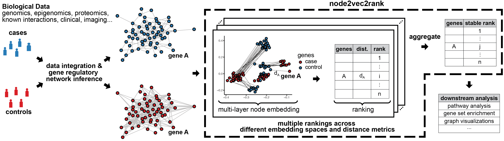

<!-- PROJECT SHIELDS -->
[![Contributors][contributors-shield]][contributors-url]
[![Forks][forks-shield]][forks-url]
[![Stargazers][stars-shield]][stars-url]
[![Issues][issues-shield]][issues-url]
[![Tests][tests-shield]][tests-url]
[![GPL-3.0 License][license-shield]][license-url]

<!-- PROJECT LOGO -->
<br />
<p align="center">
 <!--  -->
  <h3 align="center"> node2vec2rank: Large Scale and Stable Graph Differential Analysis via Node Embeddings and Ranking</h3>

  <p align="center">
    <br />
    <br />
    <a href="https://github.com/pmandros/node2vec2rank/issues">Report Bug</a>
    ·
    <a href="https://github.com/pmandros/node2vec2rank/pulls">Add Feature</a>
  </p>
</p>


<!-- TABLE OF CONTENTS -->
<details open="open">
  <summary><h2 style="display: inline-block">Table of Contents</h2></summary>
  <ol>
    <li>
      <a href="#about-the-project">About The Project</a>
    </li>
    <li>
      <a href="#getting-started">Getting Started</a>
      <ul>
        <li><a href="#installation">Installation</a></li>
      </ul>
    </li>
    <li><a href="#usage">Usage</a></li>
    <li><a href="#citation">Citation</a></li>
      <li><a href="#practicalities">Practicalities</a></li>
    <li><a href="#contributing">Contributing</a></li>
   <li><a href="#license">License</a></li>
    <li><a href="#contact">Contact</a></li>
  </ol>
</details>


<!-- ABOUT THE PROJECT -->
## About The Project
This is the code repository for https://www.biorxiv.org/content/10.1101/2024.06.16.599201v1. <br>

Computational methods in biology can infer large molecular interaction networks from multiple data modalities and resolutions, creating unprecedented opportunities to better understand complex biological phenomena. Such graphs can be built from different conditions and get contrasted to uncover graph-level differences, e.g., a case-control study utilizing gene regulatory networks. <br> 
Towards this end, we introduce **node2vec2rank**, a method for graph differential analysis that ranks nodes  according to the disparities of their representations in joint latent embedding spaces. Unlike previous bag-of-features approaches, we leverage recent advances in machine learning and statistics to compare graphs in higher-order structures and in a data-driven manner. Node2vec2rank is computationally efficient and can provably identify the correct ranking of differences. Furthermore, we incorporate stability into n2v2r for an overall procedure that adheres to veridical data science principles by running it multiple times and aggregating the results. See figure below for a demonstration simulating a case-control study. <br>

The method is not limited to comparing only two graphs. Given multiple graphs, there exist strategies such as one-versus-rest that compute pairwise comparisons based on vector arithmetic on the multi-layer node embeddings (see <a href="#practicalities">practicalities</a>).

Note, that in our case, node2vec in the title does not correspond to the algorithm by Grover and Leskovec, but rather to any algorithm that can produce (multi-layer) node embeddings. An earlier version of node2vec2rank was using node2vec with transfer learning, but it was unstable and with many paramaters. UASE is based on SVD and is more stable, more efficient, has practically no parameters, and we were able to provide theoretical guarantees about the correct ranking.  <br>

While the method is motivated and validated with biological applications, it can be used in any other domain with similar objectives. <br>

This repository provides the method, source code, and example notebooks. In particular, we provide the notebooks corresponding to the biological applications used in the paper, as well as a demo notebook for the general usage. 




<!-- GETTING STARTED -->
## Getting Started

To get a local copy up and running follow steps below.

### Installation

node2vec2rank needs Python 3.9 or newer. Install it with pip, ideally in a fresh virtual or conda environment:
   ```sh
   pip install git+https://github.com/pmandros/node2vec2rank
   ```
The core method only depends on numpy, pandas, scipy and networkx. To also run the enrichment analyses and plots in `post_utils` (as in the paper notebooks), install the `enrichment` extra:
   ```sh
   pip install "node2vec2rank[enrichment] @ git+https://github.com/pmandros/node2vec2rank"
   ```

To work from a local copy, e.g., to run the notebooks, clone the repository and install it in editable mode:
   ```sh
   git clone https://github.com/pmandros/node2vec2rank
   cd node2vec2rank
   pip install -e ".[enrichment,test]"
   pytest
   ```
The pinned conda environment used for the paper is still available with `conda env create --file environment.yaml`, followed by `conda activate n2v2r` and `pip install .`.

<!-- USAGE EXAMPLES -->
## Usage

### Running node2vec2rank in command line
To run the node2vec2rank algorithm in command line, run the following command with a configuration file as input
   ```sh
   n2v2r --config configs/config_demo_adj_CLI.json
   ```
`python -m node2vec2rank --config ...` works too. `--save_dir` and `--seed` override the config file, `--signed` also writes the rankings signed by the degree difference, and `--significance` writes per-node p- and q-values. Any parameter left out of the config file takes its default value.
The configuration file template is as follows
   ```json
{
    "data_io": {
        "save_dir": "<path_to_output>",
        "data_dir": "<path_to_data>",
        "graph_filenames": ["network_control.tsv","network_case.tsv"],
        "separator": "\t",
        "is_edge_list": false,
        "transpose": false
    },
    "data_preprocessing": {
        "project_unipartite_on": null,
        "threshold": null,
        "top_percent_keep": 100,
        "binarize": false,
        "absolute": false
    },
    "fitting_ranking": {
        "embed_dimensions": [4,6,8,10,12,14,16,18,20,22,24],
        "distance_metrics": ["euclidean","cosine"],
        "comp_strategy": "sequential",
        "seed": null,
        "verbose": 1
    }
}
   ```
The configuration parameters have the following functionality
```sh
data_io:
  --save_dir SAVE_DIR   Save directory
  --graph_filenames [GRAPH_FILENAMES ...]
                        Graph filenames
  --data_dir DATA_DIR   Data Directory
  --separator SEPARATOR
                        Separator used in the graph files
  --is_edge_list        Whether the input is an edge list or tabular
  --transpose           Whether to transpose the graph adjacency matrices or not if bipartite

data_preprocessing:
  --project_unipartite_on PROJECT_UNIPARTITE_ON
                        If the graph adjacency matrices are non-square (i.e., bipartite), it will make them square by projecting into column or row space
  --threshold THRESHOLD
                        Everything below this value will be 0
  --top_percent_keep TOP_PERCENT_KEEP
                        Keeps the top percentage of edges, turning the rest to 0
  --binarize            Whether to binarize the graphs, turning everything above 0 to 1
  --absolute            Absolute the graphs, i.e., turn negative values into positive

fitting_ranking:
  --embed_dimensions [EMBED_DIMENSIONS ...]
                        A list of all the embedding dimensions to use in n2v2r 
  --distance_metrics [DISTANCE_METRICS ...]
                        A list of all the distance metrics to use in n2v2r ("euclidean", "cosine" and/or "correlation"; correlation depends on the arbitrary signs of the singular vectors and is not recommended)
  --comp_strategy COMP_STRATEGY
                        How to compare more than two graphs: "sequential" (default), "one_vs_before" or "one_vs_rest"
  --embedding_method EMBEDDING_METHOD
                        "uase" (default) or "ulse" (regularised unfolded Laplacian embedding)
  --seed SEED           Random seed
  --verbose VERBOSE     Verbose level
```
### Using node2vec2rank from Python
Graphs can be passed directly as a list of square adjacency matrices (numpy arrays, scipy sparse matrices or pandas DataFrames) over the same nodes. Parameters are keyword arguments and default to the values above.
```python
from node2vec2rank import N2V2R

model = N2V2R([graph_control, graph_case], nodes=gene_names, seed=42)
rankings = model.fit_transform_rank()          # one DataFrame per comparison, one column per dimension/metric
borda = model.aggregate_transform()            # aggregated Borda ranking per comparison
degree_difference = model.degree_difference_ranking()
signed = model.signed_ranks_transform()        # rankings signed by the degree difference
significance = model.significance()            # per-node z, p- and q-values (see below)
```
To load graphs from files with the same options as the command line, use `DataLoader`:
```python
from node2vec2rank import DataLoader, N2V2R

loader = DataLoader("configs/config_demo_adj_CLI.json")
model = N2V2R(loader.get_graphs(), loader.get_nodes(), config=loader.config)
```

### Significance and diagnostics
`model.significance()` tests every node for a larger shift between the graphs than nodes of similar degree. Each distance is compared against a robust trend with degree (a degree-adjusted empirical null), and the results are combined into one z-score per node, a one-sided p-value and a Benjamini-Hochberg q-value. Like other empirical-null methods, it assumes that most nodes do not change. The z-score is also a ranking free of degree bias. By default it combines the same dimensions and metrics as the ranking; `significance(dimensions="elbow")` uses only the dimension at the elbow of the singular values, which is much more powerful when that elbow captures the change and fails when it does not. `n2v2r --significance` writes the results as `<comparison>_significance.tsv`.

`node2vec2rank.diagnostics` measures how much the rankings agree across dimensions and metrics (`ranking_agreement`), how strongly they follow node degree (`degree_bias`), and how often each node is in the top (`top_k_stability`). `node2vec2rank.plotting` draws these, together with the scree plot of the joint embedding (`plot_scree(model.singular_values, model.selected_dimension)`), after `pip install "node2vec2rank[plot]"`.

If you have the samples behind the networks (e.g., expression profiles for co-expression networks), `node2vec2rank.permutation.permutation_test(expression_a, expression_b)` gives an exact per-node test instead: it shuffles the samples between the two groups, rebuilds both networks (by default WGCNA-style `|cor|^6`, or any `build_network` function you pass) and compares every node with its own permutation distribution. It answers a broader question than `significance()`: whether a node's neighbourhood changed at all, including nodes whose partners were rewired. The empirical null in `significance()` instead picks out nodes that changed more than others of similar degree.

`node2vec2rank.simulate.simulate_expression` simulates expression in two conditions with known co-expression rewiring (module switches, losses and gains) and differential-expression decoys, and `coexpression_network` builds the networks. Together they provide a ground truth to try the method on.

The config also accepts `"embed_dimensions": "auto"` to use only the elbow dimension, and `"embedding_method": "ulse"` for the regularised unfolded Laplacian embedding. See [the benchmarks](benchmarks/README.md) (simulations and the locCSN single-cell networks) for when these choices help and when they hurt. On the single-cell networks and the demo network the elbow was too low, so the defaults are unchanged from the paper.

### Running in a Jupyter Notebook Environment
You can also run the code in jupyter notebook. Details about setting up your own workflow in jupyter notebook can be found in the notebooks provided. Check the demo notebook for general usage.  

<!-- Practicalities -->
## Practicalities

The input files can be either in adjacency format with index and header, or a weighted edge list (three columns of source target and edge weight) without header (the latter supported by networkx). At the moment, n2v2r accepts a list of symmetric dense numpy matrices as input, so the above input files will be converted by the Dataloader accordingly automatically. If your graphs are bipartite and in adjacency format (i.e., non-square matrices), they will be projected to unipartite with multiplication depending on the PROJECT_UNIPARTITE_ON parameter. As an example, if the graphs are in adjacency format with gene regulators in rows and genes in the columns, PROJECT_UNIPARTITE_ON = 'columns' will create symmetric networks by projecting the bipartite networks to gene space. If you want to work directly with bipartite graphs, they should be represented in edge list format and not adjacency. The multi-layer embedding (UASE) is a truncated SVD of the column-concatenated adjacency matrices, computed with `scipy.sparse.linalg.svds`; sparse inputs stay sparse. Setting `seed` makes the SVD, and so the whole run, reproducible. <br>

The output (i.e., node rankings) and config file are written to disk in the folder specified in the config file with a timestamp attached. The node rankings are all dataframes but not sorted, rather the index follows the original node order as returned by the Dataloader. In every ranking, larger values mean more differential nodes. <br>

Regarding the parameters embed_dimensions and distance_metrics, node2vec2rank runs multiple times for every parameter combination and then all the rankings are aggregated into one using the Borda scheme (tied nodes share their points). The default parameter settings have been tested thoroughly. The data_preprocessing parameters are more involved. In a nutshell, they perform graph preprocessing such as binarization, sparsifying by keeping top edges, absoluting, thresholding, and projecting bipartite graphs to unipartite. We highly recommend performing your own preprocessing and using the resulting networks with n2v2r. Otherwise, check the network_transform function and the order of network transformations. <br>

When the input is more than 2 graphs, there exists three different strategies to compare the graphs: one-vs-rest, sequential, one-vs-before. The last two imply some notion of ordering, e.g., one-vs-before implies strictly ordered graphs (e.g., longitudinal data). Node2vec2rank will perform pairwise comparisons depending on the strategies. The one-vs-rest will compare each network node embedding with the mean of the remaining network embeddings, producing for K graphs K rankings. The sequential strategy compares each graph node embedding with the next graph node embedding in the order, producing for K graphs K-1 rankings (we use this strategy in the cell cycle notebook). Lastly, the one-vs-before will compare each graph node embedding with the mean embedding of all previous graphs in the order, producing for K graphs K-1 rankings. Note that all strategies are equivalent for two graphs, but we recommend using the sequential strategy for two graphs (to better access the resulting rankings). So far we have not tested graphs with the one-vs-before strategy. The degree difference and the signed rankings follow the same comparisons and keys as the rankings, computed as the (mean) degree of the reference graph(s) minus the degree of the compared graph. <br>

The post_utils class contains functions to perform over-representation analysis (ORA) and gene set enrichment analysis (GSEA) using [GSEApy](https://gseapy.readthedocs.io/en/latest/), as well as plotting the results using bubbleplots that are saved as pdfs and are publication ready. We also include gene set libraries such as KEGG and GOBP from [MSigDB](https://www.gsea-msigdb.org/gsea/msigdb/) for your convenience. 

<!-- CITATION -->
## Citation

If you use node2vec2rank in your research, please cite the [preprint](https://www.biorxiv.org/content/10.1101/2024.06.16.599201v1) (see also `CITATION.cff`).

<!-- CONTRIBUTING -->
## Contributing

Any contributions you make are **greatly appreciated**.

1. Fork the Project
2. Create your Feature Branch (`git checkout -b feature/AmazingFeature`)
3. Commit your Changes (`git commit -m 'Add some AmazingFeature'`)
4. Push to the Branch (`git push origin feature/AmazingFeature`)
5. Open a Pull Request

Please run the test suite with `pytest` before opening a pull request.


<!--LICENSE -->
## License

Distributed under the GPL-3 License. See `LICENSE` for more information.


<!-- CONTACT -->
## Contact

[Panagiotis Mandros](https://linkedin.com/in/pmandros) - pmandros[at]hsph[dot]harvard[dot]edu <br>
[Anis Ismail](https://linkedin.com/in/anisdimail) - anis[dot]ismail[at]student[dot]kuleuven[dot]be


<!-- MARKDOWN LINKS & IMAGES -->
[contributors-shield]: https://img.shields.io/github/contributors/pmandros/node2vec2rank.svg?style=for-the-badge
[contributors-url]: https://github.com/pmandros/node2vec2rank/graphs/contributors
[forks-shield]: https://img.shields.io/github/forks/pmandros/node2vec2rank.svg?style=for-the-badge
[forks-url]: https://github.com/pmandros/node2vec2rank/network/members
[stars-shield]: https://img.shields.io/github/stars/pmandros/node2vec2rank.svg?style=for-the-badge
[stars-url]: https://github.com/pmandros/node2vec2rank/stargazers
[issues-shield]: https://img.shields.io/github/issues/pmandros/node2vec2rank.svg?style=for-the-badge
[issues-url]: https://github.com/pmandros/node2vec2rank/issues
[license-shield]: https://img.shields.io/badge/license-GPL--3.0--only-green?style=for-the-badge
[license-url]: https://github.com/pmandros/node2vec2rank/blob/main/LICENSE
[tests-shield]: https://img.shields.io/github/actions/workflow/status/pmandros/node2vec2rank/tests.yml?branch=main&label=tests&style=for-the-badge
[tests-url]: https://github.com/pmandros/node2vec2rank/actions/workflows/tests.yml
