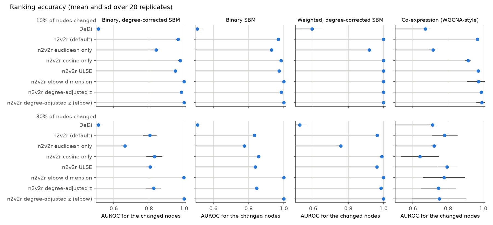
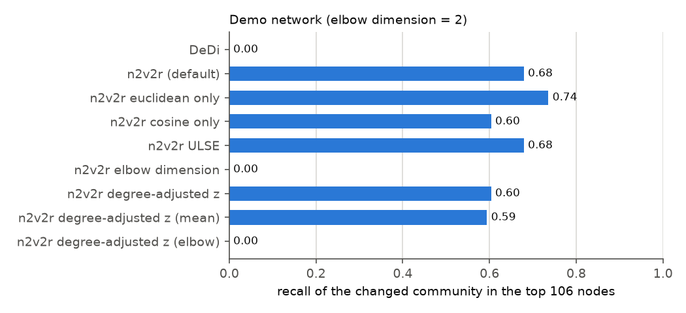
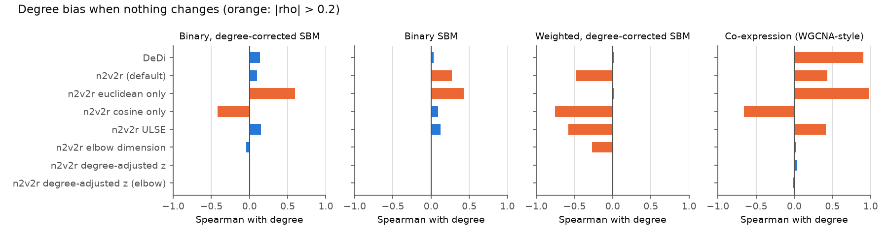
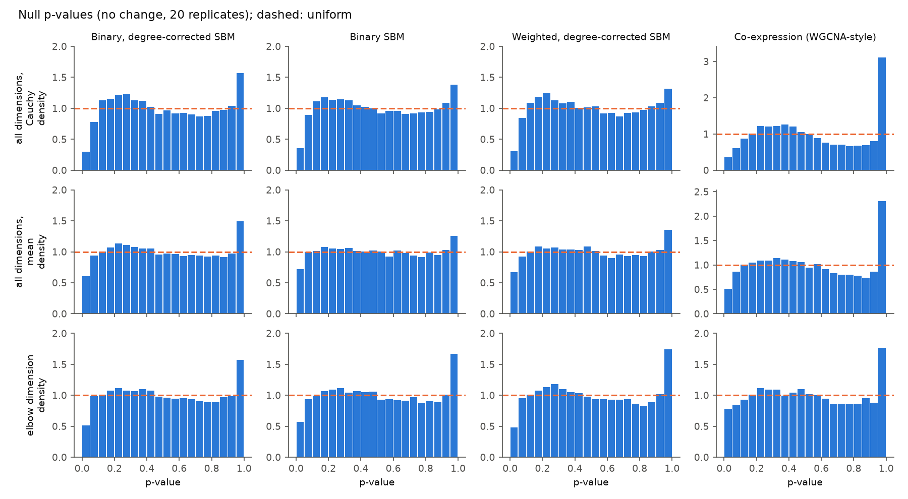
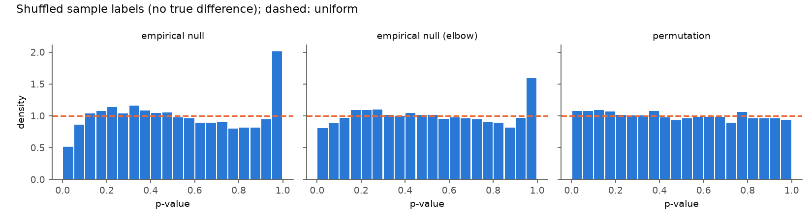
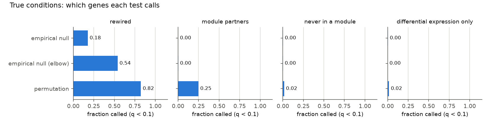
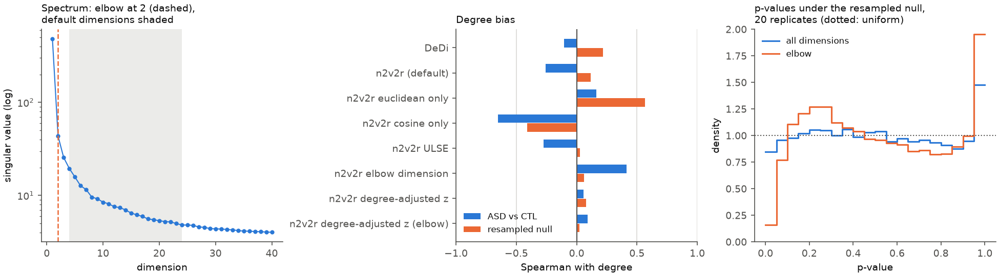
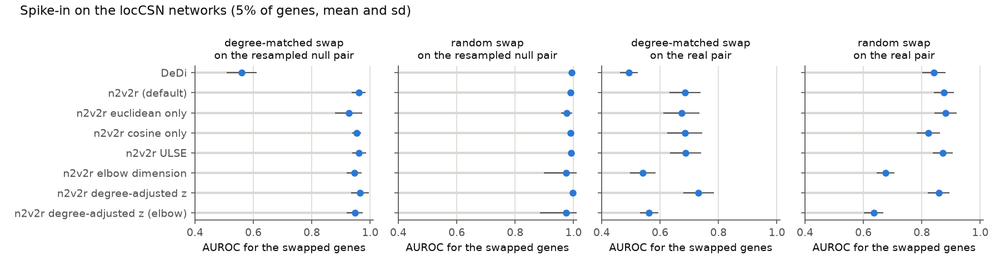

# Benchmarks

These benchmarks check how well node2vec2rank's ranking choices and the new significance test recover
nodes whose connectivity changes between two graphs. They also check how the methods behave when
nothing changes, on simulated networks, simulated expression and real single-cell networks. To
reproduce the network simulations (about 3 minutes on 4 cores):

```sh
pip install -e ".[plot]"
python benchmarks/simulations.py   # 20 replicates per setting -> results/*.csv
python benchmarks/figures.py       # -> results/*.png
```

## Setup

Every setting uses two graphs on 1,000 nodes. The "changed" nodes are 10% or 30% of the nodes, which
move to another community in the second graph. The 0% setting (no change) is used to check calibration
and degree bias. The four scenarios are:

| Scenario | Graphs |
|---|---|
| Binary, degree-corrected SBM | 4 blocks, Pareto(2.5) degree parameters, Bernoulli edges |
| Binary SBM | 4 blocks, no degree heterogeneity |
| Weighted, degree-corrected SBM | as above with Gaussian edge weights (sd 0.1) |
| Co-expression (WGCNA-style) | 150 samples of 5 latent module factors with heterogeneous loadings; 30% of genes in no module; adjacency \|cor\|^6 |

The demo network in `data/networks/demo` (1,000 nodes, 10 communities, where one community rewires
without changing degree) is included as an external check.

Methods compared, all computed from one joint embedding of 24 dimensions:

- **DeDi**: absolute degree difference.
- **n2v2r (default)**: Borda over dimensions 4, 6, …, 24 × {euclidean, cosine}, as in the paper.
- **euclidean only / cosine only**: the same Borda restricted to one metric.
- **ULSE**: the default Borda on the regularised unfolded Laplacian embedding.
- **elbow dimension**: both metrics at the single dimension picked by the Zhu–Ghodsi elbow.
- **degree-adjusted z**: the new `N2V2R.significance()`, which combines the default dimensions and
  metrics after removing each distance's trend with degree.
- **degree-adjusted z (elbow)**: `significance(dimensions="elbow")`.

## Findings

**1. Any n2v2r variant beats degree difference, as intended.** DeDi is close to random (AUROC
0.51–0.71) because moving between communities barely changes degree.



**2. The embedding dimension matters most, and no automatic choice is safe.** At 10% change the
default Borda reaches AUROC 0.965–1.0. At 30% change it drops to 0.78–0.83 in the binary and
co-expression scenarios. The elbow dimension recovers 1.0 in all three SBM scenarios, because the
dimensions beyond the true rank are mostly noise and dilute the Borda. On the demo network, however,
the elbow sits at dimension 2 while the change lives in weaker dimensions (the spectrum has several
gaps). There the elbow finds none of the changed community, while the default Borda recovers 68%.
Averaging over dimensions 4–24 is therefore a reasonable hedge, and it remains the default. The elbow
is offered as an option (`embed_dimensions: "auto"`, `significance(dimensions="elbow")`) and should be
checked against the scree plot (`plotting.plot_scree`).



**3. Raw distances are degree-biased, in opposite directions for the two metrics.** With no change,
Euclidean rankings correlate positively with degree (Spearman up to 0.98 in co-expression networks,
0.59 in degree-corrected SBMs): hubs have large embedding norms, so their noise is large in absolute
terms. Cosine rankings correlate negatively (down to −0.76), because low-degree nodes have noisy
directions. The default Borda over both metrics partly cancels these biases, but it keeps whichever
dominates (−0.48 to 0.43). This justifies mixing the metrics better than either alone, but not fully.
The degree-adjusted z removes the bias in every scenario (|rho| ≤ 0.04) and ranks as well as or better
than the default Borda in 7 of 8 settings (it loses 0.03 AUROC in co-expression with 30% change). It
also recovers 58% of the demo's changed community, against 68% for the default Borda.



**4. The p-values are valid but conservative, and powerful only when the signal is concentrated.**
With no change, 2.5–4.5% of nodes have p < 0.05, and the three SBM scenarios had no false calls at
q < 0.1 in any replicate. The co-expression networks have heavier tails: 20–35% of null replicates
produced 1–4 false calls at q < 0.1, so a stricter q is advisable there. Power at q < 0.1 with 10%
change is 0.95–1.0 with the elbow dimension (0.79 for co-expression). With the default dimensions it
is 0.95 for weighted graphs, 0.22 for co-expression and near 0 for binary graphs, where the noisy high
dimensions dilute the combined score. With 30% change power drops for both variants (at best 0.70,
for weighted graphs with the elbow dimension). The empirical null assumes that most nodes
do not change, so it absorbs part of a change that affects a third of the graph; calls stay
conservative (no false discoveries) rather than inflated.



**5. The regularised Laplacian embedding (ULSE) brings no consistent gain.** Its AUROC is within ±0.02
of UASE everywhere. It remains available as `embedding_method: "ulse"` for networks with extreme hubs,
but it is not the default.

**6. A simulation-based (parametric bootstrap) null was tried and not adopted.** Re-embedding graphs
simulated from the fitted low-rank model gives per-node p-values whose calibration depends heavily on
the assumed rank. With rank 8 instead of the true 3, 10% of null nodes had p < 0.05; at the true rank
the share was 1.5%. It is also expensive at 20,000 nodes and needs a noise model for weighted networks.

## Simulated expression data

`benchmarks/expression.py` (about 10 minutes) simulates gene expression rather than networks. It uses
`node2vec2rank.simulate`: 1,000 genes, 100 samples per condition, 5 modules, and 10% of genes rewired
(module switch, loss or gain). Another 10% of genes are differential-expression decoys, whose mean
shifts but whose co-expression does not. Networks are built as the paper does (`|cor|^6`), with 10
replicates. Three tests are compared: `significance()` with all dimensions and with the elbow
dimension, and the new sample-label `permutation_test` (100 permutations).

**Calibration with shuffled sample labels.** Pooling both conditions and splitting the samples at
random leaves no true difference between the groups. The permutation test is close to uniform: 5.4%
of genes have p < 0.05 (3.9–8.6% per replicate), with one false call at q < 0.1 in 10 replicates. The
empirical null is conservative (2.6% all dimensions, 4.0% elbow), with 2 false calls in 10
replicates for the elbow variant. A first version of the permutation test standardised distances by
their permutation mean and sd. It failed on one random split, where two near-equal singular values
made a single dimension unstable, and called 202 genes. Its scores are now rank-based, so no single
dimension can dominate.



**Power against the known rewiring.** The tests answer different questions:

- The permutation test calls 82% of rewired genes. It also calls 25% of their module partners,
  whose co-expression neighbourhood genuinely changed when a gene joined or left their module. Only
  2% of genes that are never in a module, and 2% of differential-expression decoys, are called.
- The empirical null calls only the genes that stand out from genes of similar degree: 54% of
  rewired genes with the elbow dimension and 18% with all dimensions. It calls no partners and no
  decoys.
- For ranking the rewired genes, AUROC is 0.98 for the elbow z-score, 0.96 for the all-dimension
  z-score, 0.91 for the default Borda and 0.90 for the permutation z-score. The permutation score
  ranks partners high too.



In practice, use `permutation_test` when the samples are available and "did this gene's co-expression
change at all" is the question. Use `significance()` when only the networks are available, or to
prioritise the most rewired genes.

## Real single-cell networks

`benchmarks/real_data.py` (about 2 minutes) uses the locCSN networks of autism (ASD) and control
(CTL) brain cells that used to be in `data/networks/locscn` (942 genes; read from git history, or from
`--data-dir`). Each edge weight is the fraction of cells in which the edge is present, over 211 control
and 238 ASD cells. The per-cell networks are not in the repository, so the permutation test cannot be
run, and a null has to be built from the averaged networks. The resampled null redraws both networks
from the pooled edge frequencies, Binomial(cells, pooled frequency) / cells for every edge. It keeps
the degree structure and edge-level sampling noise, while no gene differs between the groups. It
treats edges as independent across cells, so it is less noisy than a cell-level resampling would be.
The spike-ins swap the neighbourhoods of 5% of genes in pairs, either between genes adjacent in
degree (degree-preserving) or between random genes, on top of the resampled null or the real pair.
There are 20 replicates of each.



**1. The elbow is too aggressive on real networks.** The spectrum has one dominant singular value (480,
then 43, 26, 20) and a long smooth tail, so the elbow is dimension 2. The elbow ranking agrees poorly
with the default one (Spearman 0.35, 12 genes in common in the top 50). On the real pair it also
recovers spike-ins much worse: AUROC 0.68 against 0.88 for the default Borda with random swaps, and
0.54 against 0.69 with degree-matched swaps. On the resampled null, where the only structure is
the dominant one, the two are close (0.95 against 0.96). This is the demo network's failure again, and
it supports keeping the averaged dimensions as the default.

**2. The degree biases seen in simulations hold on real data.** Under the resampled null, Euclidean
rankings correlate with degree at 0.57 and cosine rankings at −0.41. The default Borda is at 0.12, and
the degree-adjusted z at 0.08. On ASD vs CTL itself the cosine bias is −0.65, the default Borda −0.26
and the elbow Borda 0.42, while the z-scores stay at 0.06–0.09.

**3. The degree-adjusted test is calibrated on the resampled null.** With all dimensions, 4.2% of genes
have p < 0.05 (at most 5.4% in a replicate), and one gene was called at q < 0.1 in 20 replicates. The
elbow variant is conservative (0.8%, no calls). The excess of p-values near 1 comes from genes that
change less than their degree peers, which only makes the one-sided test conservative. Genes isolated
in both networks (23 here) are now left untested by `significance()`, instead of entering the
degree trend with a zero distance.

**4. A naive null that swaps edges between the networks is not valid per gene.** Swapping every edge's
weight between ASD and CTL with probability ½ keeps the size of each gene's edge differences and only
randomises their direction. The genes that differ most in the real data therefore keep large
distances, and the same 9–17 genes are called in every replicate (6.6% of genes with p < 0.05). It is
included in the results as a warning, not as a calibration check.

**5. ASD vs CTL has no significant gene.** No gene reaches q < 0.1 with either variant, and 4.0% of
genes have p < 0.05 (2.8% with the elbow), which is close to what the null gives. The top of the
default ranking is led by NLGN4Y (p = 0.0003, q = 0.23) and USP9Y (p = 0.001), two Y-chromosome genes.
NLGN4Y's degree drops from 270 in CTL to 112 in ASD. This looks like a difference in the sex
composition of the donors or cells, rather than autism biology. This is inferred from the gene names;
the donor metadata is not in the repository. The next genes (STXBP1, CAMK4, CNTN3, SCN8A, GRIN2B) are
neuronal genes with nominal p-values between 0.005 and 0.02.

**6. The real differences dwarf the resampled noise.** Spike-ins on the resampled null are easy (AUROC
0.93–1.0 for the n2v2r rankings, power at q < 0.1 of 0.83–0.91 for the z-score). On the real pair, the same spike-ins rank at
0.69–0.88 and are almost never called. The real ASD–CTL differences are much larger than the edge-level
sampling noise of the averaged networks. They include biology, donor effects and the within-cell
correlation of edges that the resampled null ignores. So the resampled null checks the degree
adjustment, but it cannot say whether the ASD–CTL differences exceed what two random groups of cells
would show. That needs the per-cell networks and `permutation_test`.



The hdWGCNA cell-cycle networks used in the paper are on Zenodo (10.5281/zenodo.10558426) and are
not in the repository, so they were not tested.

## Limitations

The simulations are small (1,000-node), two-graph settings with community-switch changes. Real
regulatory and co-expression networks have more gradual changes, larger size and no clean rank. The
simulated-expression benchmark covers the sample-level null, but the locCSN networks come without
their cells. The remaining check is the shuffled-label calibration on real per-cell or per-sample data.
