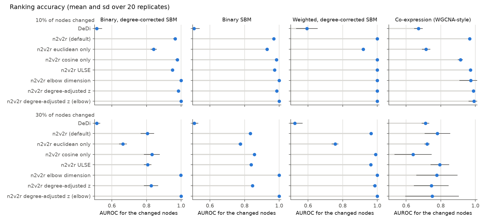
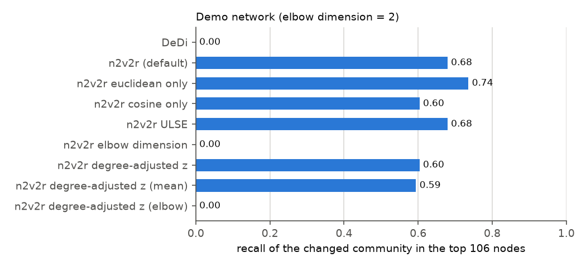
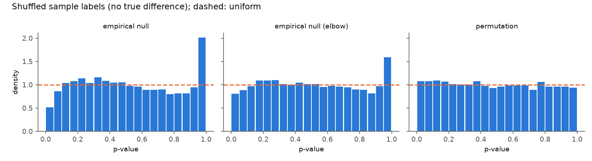
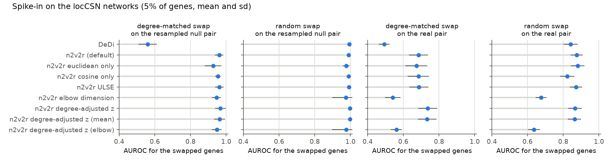

# Benchmarks

These benchmarks check how well node2vec2rank's ranking choices and the new significance test recover
nodes whose connectivity changes between two graphs. They also check how the methods behave when
nothing changes, on simulated networks, simulated expression and real single-cell networks. To
reproduce the network simulations (about 3 minutes on 4 cores):

```sh
pip install -e ".[plot]"
python benchmarks/simulations.py   # 20 replicates per setting -> results/*.csv
python benchmarks/figures.py       # -> results/*.png
```

Every section before "Total and own move, ..." is about the total move of a node alone (`align=None`, the method
of the paper); the scripts behind them set it or use the distances directly. That section compares it with the own
move and with the default, which uses both. The last section, "Which module changed", is about whole modules.

## Setup

Every setting uses two graphs on 1,000 nodes. The "changed" nodes are 10% or 30% of the nodes, which
move to another community in the second graph. The 0% setting (no change) is used to check calibration
and degree bias. The four scenarios are:

| Scenario | Graphs |
|---|---|
| Binary, degree-corrected SBM | 4 blocks, Pareto(2.5) degree parameters, Bernoulli edges |
| Binary SBM | 4 blocks, no degree heterogeneity |
| Weighted, degree-corrected SBM | as above with Gaussian edge weights (sd 0.1) |
| Co-expression (WGCNA-style) | 150 samples of 5 latent module factors with heterogeneous loadings; 30% of genes in no module; adjacency \|cor\|^6 |

The demo network in `data/networks/demo` (1,000 nodes, 10 communities, where one community rewires
without changing degree) is included as an external check.

Methods compared, all computed from one joint embedding of 24 dimensions:

- **DeDi**: absolute degree difference.
- **n2v2r (default)**: Borda over dimensions 4, 6, …, 24 × {euclidean, cosine}, as in the paper.
- **euclidean only / cosine only**: the same Borda restricted to one metric.
- **ULSE**: the default Borda on the regularised unfolded Laplacian embedding.
- **elbow dimension**: both metrics at the single dimension picked by the Zhu–Ghodsi elbow.
- **degree-adjusted z**: the new `N2V2R.significance()`. It removes each distance's trend with degree,
  averages the scores within windows of two neighbouring dimensions (both metrics) and combines the
  windows with a Cauchy combination test.
- **degree-adjusted z (mean)**: `significance(combine="mean")`, which averages all default dimensions
  and metrics instead (the first version of the test).
- **degree-adjusted z (elbow)**: `significance(dimensions="elbow")`.

## Findings

**1. Any n2v2r variant beats degree difference, as intended.** DeDi is close to random (AUROC
0.51–0.71) because moving between communities barely changes degree.



**2. The embedding dimension matters most, and no automatic choice is safe.** At 10% change the
default Borda reaches AUROC 0.965–1.0. At 30% change it drops to 0.78–0.83 in the binary and
co-expression scenarios. The elbow dimension recovers 1.0 in all three SBM scenarios, because the
dimensions beyond the true rank are mostly noise and dilute the Borda. On the demo network, however,
the elbow sits at dimension 2 while the change lives in weaker dimensions (the spectrum has several
gaps). There the elbow finds none of the changed community, while the default Borda recovers 68%.
Averaging over dimensions 4–24 is therefore a reasonable hedge, and it remains the default. The elbow
is offered as an option (`embed_dimensions: "auto"`, `significance(dimensions="elbow")`) and should be
checked against the scree plot (`plotting.plot_scree`).



**3. Raw distances are degree-biased, in opposite directions for the two metrics.** With no change,
Euclidean rankings correlate positively with degree (Spearman up to 0.98 in co-expression networks,
0.59 in degree-corrected SBMs): hubs have large embedding norms, so their noise is large in absolute
terms. Cosine rankings correlate negatively (down to −0.76), because low-degree nodes have noisy
directions. The default Borda over both metrics partly cancels these biases, but it keeps whichever
dominates (−0.48 to 0.43). This justifies mixing the metrics better than either alone, but not fully.
The degree-adjusted z removes the bias in every scenario (mean |rho| ≤ 0.04) and ranks as well as or
better than the default Borda in 7 of 8 settings (it loses 0.03 AUROC in co-expression with 30%
change). It also recovers 60% of the demo's changed community, against 68% for the default Borda.


**4. The p-values are valid but conservative, and combining dimensions by windows keeps most of the
signal.** With no change, 1.5–1.8% of nodes have p < 0.05 (2.6–3.6% with the mean over dimensions,
2.4–3.9% with the elbow dimension), and no variant made a false call at q < 0.1 in any of the 20
replicates of any scenario (see the next section for harder co-expression nulls). Power at q < 0.1
with 10% change:

| Scenario | all dimensions, Cauchy (default) | all dimensions, mean | elbow dimension |
|---|---|---|---|
| Binary, degree-corrected SBM | 0.45 | 0.02 | 1.00 |
| Binary SBM | 0.87 | 0.00 | 1.00 |
| Weighted, degree-corrected SBM | 0.96 | 0.95 | 1.00 |
| Co-expression | 0.18 | 0.26 | 0.79 |

In the binary SBMs the change lives in the first few dimensions. Averaging all 22 combinations of
dimension and metric dilutes it with the noise of the higher dimensions, so the mean calls almost
nothing. The Cauchy combination is dominated by the strongest window, so the signal survives, and the
windows keep a single unstable dimension from dominating. In co-expression networks the change is
spread over many dimensions, and the mean is somewhat more powerful. The z-score ranking is the same
for both (AUROC within 0.01). With 30% change power drops for every variant (at best 0.70, for
weighted graphs with the elbow dimension; 0.14 with the Cauchy combination and 0 with the mean). The
empirical null assumes that most nodes do not change, so it absorbs part of a change that affects a
third of the graph; calls stay conservative (no false discoveries) rather than inflated.

Two details were needed to keep the windows calibrated. First, a single window is more sensitive than
the mean to how well the degree trend fits the largest hubs. The trend uses the rank of each node's
degree, which squeezes hubs of very different degree together, so above the 95th percentile the
position now grows with log degree instead (`log_tail` in `covariate_adjusted_zscores`). Without it
the weighted SBM null gave false calls in 20% of replicates. Second, windows of two dimensions work
better than single dimensions, which gave false calls when two near-equal singular values made one
cosine distance unstable, and better than windows of three, which lost most of the binary SBM gain.
Disjoint blocks of dimensions (1–4, 5–8, ...) were also tried; the noisy high blocks swamped the
signal. These exploratory runs are not in the repository.

Neither combination finds pure hub changes. In the mixed hub-and-community simulations of the
two-truths analysis (4-block degree-corrected SBM, 2,000 nodes, 5% of nodes doubling or halving their
degree parameter), both made no or almost no calls (at most 3% of the changed nodes) with the default
distances or with the radial (norm) distance, while the same test on the degree difference called 65%
of hub changes in Poisson-weighted graphs (0% in binary ones), with no false calls in either case.
A node that only gains or loses connections within its community moves along its own direction, and
the degree adjustment compares it with nodes of its new degree, which absorbs most of that move.


**Calibration of the significance test.** An independent review found that the test is conservative
and that the elbow variant gave false calls on co-expression networks in which many genes belong to
no module. `benchmarks/calibration.py` reproduces its null scenarios with 30 replicates each:
degree-corrected SBMs with Pareto or lognormal degrees, a weighted one, and co-expression networks
from 60 or 150 samples with 40% of genes in no module. In every replicate both graphs come from the
same model, so any call is false. At q < 0.1, Benjamini-Hochberg allows a call in up to 10% of such
replicates.

| Null scenario (30 replicates) | p < 0.05: Cauchy | mean | replicates with a call at q < 0.1: Cauchy | mean | elbow, quadratic trend | elbow, spline trend |
|---|---|---|---|---|---|---|
| DCSBM, Pareto degrees | 0.5% | 1.4% | 0% | 0% | 0% | 0% |
| DCSBM, lognormal degrees | 0.8% | 1.8% | 0% | 0% | 0% | 0% |
| weighted DCSBM | 0.6% | 1.6% | 3% | 0% | 0% | 0% |
| co-expression, 150 samples | 1.2% | 1.5% | 13% | 0% | 13% | 13% |
| co-expression, 60 samples | 0.9% | 1.7% | 0% | 0% | **77%** | **3%** |

The Cauchy and mean columns use all default dimensions and the spline trend. The Cauchy combination
made a call in 4 of the 30 co-expression replicates with 150 samples, one or two genes each time. That
is in line with the 10% that the FDR level allows under a complete null (the mean made none, because
it is more conservative). With the elbow dimension the two combinations are the same up to the hub
adjustment and give the same calls.

- The false calls came from the degree trend, not from the tails. The lowest-degree genes (those in no
  module) have embeddings close to zero, so their distances rise steeply at the bottom of the degree
  range. The quadratic trend bent at the ends and missed that rise. The trend is now a natural cubic
  spline with knots at the degree quartiles. It has as many parameters as the quadratic, so a changed
  group that shares a degree keeps its signal (a unit test checks this), but it is linear beyond the
  outer knots. It removes almost all of those false calls and changes the ranking AUROCs by at most
  0.01 elsewhere. `trend="polynomial"` in `empirical_null_test` keeps the old fit.
- The conservativeness was not fixed. The log distances are left-skewed, so the combined scores have a
  thinner upper tail than a normal distribution, and 0.5–3.9% of null nodes have p < 0.05. Three
  corrections were tried on these nulls, on the network simulations and on the resampled locCSN null:
  a Box-Cox transform per distance chosen to make the scores symmetric, a Yeo-Johnson transform of the
  combined score, and a scale estimated from the upper half of the scores. Each moved the rate at
  p < 0.05 toward 5%, but the first two gave false calls. The Box-Cox version made about 9 calls per
  replicate on the resampled locCSN null, and the Yeo-Johnson version about 9 per replicate with the
  elbow dimension on the simulated co-expression null. These exploratory runs are not in the repository. The upper-half scale lost all power when 30% of nodes changed. The conservative
  version is kept: its calls can be trusted, but it misses changes that a calibrated test would find.
  The permutation test (below) is calibrated when the samples are available.

**5. The regularised Laplacian embedding (ULSE) brings no consistent gain.** Its AUROC is within ±0.02
of UASE everywhere. It remains available as `embedding_method: "ulse"` for networks with extreme hubs,
but it is not the default.

**6. A simulation-based (parametric bootstrap) null was tried and not adopted.** Re-embedding graphs
simulated from the fitted low-rank model gives per-node p-values whose calibration depends heavily on
the assumed rank. With rank 8 instead of the true 3, 10% of null nodes had p < 0.05; at the true rank
the share was 1.5%. It is also expensive at 20,000 nodes and needs a noise model for weighted networks.

## Simulated expression data

`benchmarks/expression.py` (about 10 minutes) simulates gene expression rather than networks. It uses
`node2vec2rank.simulate`: 1,000 genes, 100 samples per condition, 5 modules, and 10% of genes rewired
(module switch, loss or gain). Another 10% of genes are differential-expression decoys, whose mean
shifts but whose co-expression does not. Networks are built as the paper does (`|cor|^6`), with 10
replicates. Four tests are compared: `significance()` with all dimensions (Cauchy combination and
mean) and with the elbow dimension, and the new sample-label `permutation_test` (100 permutations).

**Calibration with shuffled sample labels.** Pooling both conditions and splitting the samples at
random leaves no true difference between the groups. The permutation test is close to uniform: 5.4%
of genes have p < 0.05 (3.9–8.6% per replicate), with one false call at q < 0.1 in 10 replicates. The
empirical null is conservative (0.8% with the Cauchy combination, 2.2% with the mean, 3.4% with the
elbow), with no false calls in 10 replicates. A first version of the permutation test standardised distances by
their permutation mean and sd. It failed on one random split, where two near-equal singular values
made a single dimension unstable, and called 202 genes. Its scores are now rank-based, so no single
dimension can dominate.



**Power against the known rewiring.** The tests answer different questions:

- The permutation test calls 82% of rewired genes. It also calls 25% of their module partners,
  whose own connections did not change: a gene joining or leaving their module changes their
  neighbourhood and moves them in the joint embedding. Only 2% of genes that are never in a module,
  and 2% of differential-expression decoys, are called. Its null is that the two groups do not differ
  at all, so under a real difference it is not a per-gene test and its q-values do not control the
  false discovery rate among genes.
- The empirical null calls only the genes that stand out from genes of similar degree: 53% of
  rewired genes with the elbow dimension, 24% with the mean over all dimensions and 12% with the
  Cauchy combination. Here the change is spread over many dimensions, which favours the mean, as in
  the simulated co-expression networks above. It calls almost no partners or decoys (at most 0.4%).
- For ranking the rewired genes, AUROC is 0.98 for the elbow z-score, 0.96 for both all-dimension
  z-scores, 0.91 for the default Borda and 0.90 for the permutation z-score. The permutation score
  ranks partners high too.


In practice, use `permutation_test` when the samples are available and the question is whether the
networks differ at all and around which genes. Use `significance()` when only the networks are available, or to
prioritise the most rewired genes.

## Real single-cell networks

`benchmarks/real_data.py` (about 2 minutes) uses the locCSN networks of autism (ASD) and control
(CTL) brain cells that used to be in `data/networks/locscn` (942 genes; read from git history, or from
`--data-dir`). Each edge weight is the fraction of cells in which the edge is present, over 211 control
and 238 ASD cells. The per-cell networks are not in the repository, so the permutation test cannot be
run, and a null has to be built from the averaged networks. The resampled null redraws both networks
from the pooled edge frequencies, Binomial(cells, pooled frequency) / cells for every edge. It keeps
the degree structure and edge-level sampling noise, while no gene differs between the groups. It
treats edges as independent across cells, so it is less noisy than a cell-level resampling would be.
The spike-ins swap the neighbourhoods of 5% of genes in pairs, either between genes adjacent in
degree (degree-preserving) or between random genes, on top of the resampled null or the real pair.
There are 20 replicates of each.


**1. The elbow is too aggressive on real networks.** The spectrum has one dominant singular value (480,
then 43, 26, 20) and a long smooth tail, so the elbow is dimension 2. The elbow ranking agrees poorly
with the default one (Spearman 0.35, 12 genes in common in the top 50). On the real pair it also
recovers spike-ins much worse: AUROC 0.68 against 0.88 for the default Borda with random swaps, and
0.54 against 0.69 with degree-matched swaps. On the resampled null, where the only structure is
the dominant one, the two are close (0.95 against 0.96). This is the demo network's failure again, and
it supports keeping the averaged dimensions as the default.

**2. The degree biases seen in simulations hold on real data.** Under the resampled null, Euclidean
rankings correlate with degree at 0.57 and cosine rankings at −0.41. The default Borda is at 0.12, and
the degree-adjusted z at 0.07. On ASD vs CTL itself the cosine bias is −0.65, the default Borda −0.26
and the elbow Borda 0.42, while the z-scores stay at 0.06–0.09.

**3. The degree-adjusted test is calibrated on the resampled null.** With all dimensions, 3.2% of genes
have p < 0.05 (at most 5.2% in a replicate) and no gene was called at q < 0.1 in 20 replicates. The mean
over dimensions gives 4.3% and called two genes in 20 replicates. The elbow variant is conservative
(0.8%, no calls). The excess of p-values near 1 comes from genes that
change less than their degree peers, which only makes the one-sided test conservative. Genes isolated
in both networks (23 here) are now left untested by `significance()`, instead of entering the
degree trend with a zero distance.

**4. A naive null that swaps edges between the networks is not valid per gene.** Swapping every edge's
weight between ASD and CTL with probability ½ keeps the size of each gene's edge differences and only
randomises their direction. The genes that differ most in the real data therefore keep large
distances, and the same 8–15 genes are called in every replicate (5.5–6.5% of genes with p < 0.05). It is
included in the results as a warning, not as a calibration check.

**5. ASD vs CTL has no significant gene.** No gene reaches q < 0.1 with any variant, and 3.8% of
genes have p < 0.05 (3.6% with the mean, 2.8% with the elbow), which is close to what the null gives.
The top of the default ranking is led by NLGN4Y (p = 0.001, q = 0.64) and USP9Y (p = 0.001), two
Y-chromosome genes.
NLGN4Y's degree drops from 270 in CTL to 112 in ASD. This looks like a difference in the sex
composition of the donors or cells, rather than autism biology. This is inferred from the gene names;
the donor metadata is not in the repository. The next genes (STXBP1, CAMK4, CNTN3, SCN8A, GRIN2B) are
neuronal genes with nominal p-values between 0.009 and 0.03.

**6. The real differences dwarf the resampled noise.** Spike-ins on the resampled null are easy (AUROC
0.93–1.0 for the n2v2r rankings, power at q < 0.1 of 0.89–0.93 for the z-score, against 0.83–0.91 with
the mean over dimensions). On the real pair, the same spike-ins rank at 0.69–0.88 and are rarely
called (power 0.09–0.10, against 0.05 with the mean). The real ASD–CTL differences are much larger than the edge-level
sampling noise of the averaged networks. They include biology, donor effects and the within-cell
correlation of edges that the resampled null ignores. So the resampled null checks the degree
adjustment, but it cannot say whether the ASD–CTL differences exceed what two random groups of cells
would show. That needs the per-cell networks and `permutation_test`.



The hdWGCNA cell-cycle networks used in the paper are on Zenodo (10.5281/zenodo.10558426) and are
not in the repository, so they were not tested.

## Pathway tests on single cells: HeLa cell cycle

`benchmarks/cell_cycle.py` uses the HeLa S3 scRNA-seq of
[Revelio](https://github.com/danielschw188/Revelio) (1,564 cells, WT and Ago2KO batches), the cells
behind the paper's cell-cycle networks. Phases are assigned with Revelio's marker-gene method (87
outlier cells dropped) and merged into G1 (M/G1 + G1/S, 838 cells), S (258), G2 (186) and M (195).
Networks are built hdWGCNA style from the 2,000 most variable genes: metacells (k = 25, at most 10
shared cells) per phase, signed WGCNA adjacency with soft power 10 (the lowest with scale-free fit
above 0.8). For the paper's sequential comparisons, the Reactome library (534 sets with 5–500 genes
in the data, 64 of them cell-cycle sets by name) is tested with GSEA prerank on the n2v2r Borda
ranking and on absDeDi, as in the paper's notebook, and with `gene_set_test` (1,000 cell-label
permutations within batch) for n2v2r and for DeDi. As a null control, the G1 cells of each batch are
split at random into two halves.

| comparison | method | pathways at FDR 0.1 | cell-cycle pathways at FDR 0.1 | AUROC of cell-cycle pathways |
|---|---|---|---|---|
| G1 → S | GSEA prerank, n2v2r | 112 | 38 | 0.83 |
| | GSEA prerank, DeDi | 74 | 34 | 0.84 |
| | permutation test, n2v2r | 146 | **59** | **0.91** |
| | permutation test, DeDi | 72 | 31 | 0.87 |
| S → G2 | GSEA prerank, n2v2r | 75 | 18 | 0.54 |
| | GSEA prerank, DeDi | 32 | 22 | 0.59 |
| | permutation test, n2v2r | 135 | **36** | **0.72** |
| | permutation test, DeDi | 38 | 16 | 0.65 |
| G2 → M | GSEA prerank, n2v2r | 153 | 27 | 0.57 |
| | GSEA prerank, DeDi | 90 | 20 | 0.61 |
| | permutation test, n2v2r | 104 | **34** | **0.74** |
| | permutation test, DeDi | 0 | 0 | 0.62 |
| **null: G1 halves** | GSEA prerank, n2v2r | **23** | 11 | 0.52 |
| | GSEA prerank, DeDi | **12** | 8 | 0.67 |
| | permutation test, n2v2r | 0 | 0 | 0.47 |
| | permutation test, DeDi | 0 | 0 | 0.55 |

Full numbers: `results/cell_cycle.csv`; top sets per comparison and method:
`results/cell_cycle_top_sets.csv`.

**1. GSEA prerank on network rankings is not calibrated on real data.** Two random halves of the same
G1 cells give 23 Reactome pathways at FDR 0.1 with the n2v2r ranking and 12 with DeDi, led by
REACTOME_CELL_CYCLE, M_PHASE and MITOTIC_PROMETAPHASE at q ≈ 0: the pathways the paper reports for
the real comparisons. They most likely come out because their genes are strongly co-expressed
(cells labelled G1 still spread along the cycle), not because anything differs. The cell-label permutation
test calls nothing on the same split, in line with the simulations (no false call at FDR 0.1 in 12
null replicates; nominal p < 0.05 for 4–7% of sets).

**2. With a calibrated test, n2v2r clearly beats DeDi.** n2v2r calls more cell-cycle pathways in
every comparison (59 vs 31, 36 vs 16, 34 vs 0) and ranks them higher (AUROC 0.91/0.72/0.74 vs
0.87/0.65/0.62). Under GSEA prerank the two look similar, because both are dominated by the same
co-expression artefact. At G2 → M, DeDi finds nothing, while n2v2r's top sets are the expected ones
(condensation of prometaphase chromosomes, G2/M phases, M phase, APC/C degradation, PLK1 at G2/M).

**Caveats.** Phases are assigned from cell-cycle marker genes, so cell-cycle pathways are the easiest
positives (every gene is z-scored within phase and batch before building the networks, so mean
expression differences do not enter them). The cell-cycle label is a regular expression on Reactome
names, so "pathways at FDR 0.1" also includes real, non-cell-cycle changes between phases and
is not a false-positive count. Cells of one cell line are treated as exchangeable within batch; with
several donors, shuffle donors instead. The paper's own hdWGCNA networks (Zenodo) could not be
downloaded here, so these networks follow the hdWGCNA recipe but are not the same files, and the
merge of Revelio's five phases into four is an assumption.

**The phase merge.** The paper does not say how Revelio's five phases were merged into four, so
`--phase-merge` tries three merges with the fast test (`results/cell_cycle_fast*.csv`):
"default" (G1 = M/G1 + G1/S, M = G2/M), "later" (every transition goes to the phase it leads into)
and "earlier" (every transition goes to the phase it leaves). Cell-cycle pathways at FDR 0.1, n2v2r
vs DeDi:

| merge | cells G1 / S / G2 / M | G1 → S | S → G2 | G2 → M | null split |
|---|---|---|---|---|---|
| default | 838 / 258 / 186 / 195 | 53 vs 39 | 6 vs 11 | 23 vs 0 | 0 vs 0 |
| later | 320 / 776 / 186 / 195 | 44 vs 0 | 36 vs 22 | 20 vs 0 | 0 vs 0 |
| earlier | 518 / 258 / 381 / 320 | 40 vs 7 | 13 vs 10 | 37 vs 0 | 0 vs 0 |

The conclusions do not depend on the merge: no calls on the null split, and n2v2r finds more
cell-cycle pathways than DeDi in all comparisons but one, and far more at G2 → M. The "earlier" merge
gives the most balanced phases.

### Which calls are true? Planted changes and split halves

"More cell-cycle pathways" is only a proxy: the cell-cycle label comes from pathway names, and a
pathway without it is not necessarily false. `benchmarks/cell_cycle_validation.py` adds two checks
with a real answer (1,000 permutations; about 75 minutes on 4 cores).

**Planted changes in real cells.** The G1 cells of each batch are split at random, so nothing differs
between the halves. In the second half, 30% or 60% of the genes of 6–8 disjoint Reactome sets
(15–100 genes) lose their co-expression: each gene's values are shuffled across the cells of a batch,
which keeps its expression level. Planted sets are the true positives. Sets that contain none of the
shuffled genes are counted as negatives (sets that share some are left out). Three replicates per
strength (`results/cell_cycle_spike_in*.csv`):

| method | recall at FDR 0.1 (30% / 60%) | calls among negatives (30% / 60%) | AUROC planted vs negatives | median rank of planted sets |
|---|---|---|---|---|
| GSEA prerank, n2v2r | 0.11 / 0.25 | 5.0 / 6.0 | 0.68 / 0.67 | 68 / 35 |
| GSEA prerank, DeDi | 0.11 / 0.21 | 2.7 / 0.3 | 0.69 / 0.79 | 57 / 25 |
| permutation test, n2v2r | 0.06 / **0.42** | 1.3 / 0.7 | **0.83 / 0.95** | **20 / 5** |
| permutation test, DeDi | 0.06 / 0.38 | 2.7 / 0.7 | 0.80 / **0.98** | 28 / 5.5 |
| fast test, n2v2r | 0.15 / 0.29 | 3.7 / 2.0 | 0.81 / 0.91 | 34 / 11 |
| fast test, DeDi | 0.06 / 0.29 | 2.0 / 0.3 | 0.77 / 0.97 | 34 / 7 |

The "negatives" are not a clean null: when a gene loses its co-expression, its partners lose edges
too, so sets of partners do change in network terms. Even so, GSEA on the n2v2r ranking makes the most
of these calls and ranks the planted sets far lower. With the permutation test, the planted sets rank
near the top (median 5th of about 140–250 sets at 60%). At 30% every method has little power at FDR
0.1, but the permutation tests still rank the planted sets better (AUROC 0.80–0.83 vs 0.68–0.69). With
this loss-of-co-expression change, n2v2r and DeDi perform similarly under a calibrated test. The
larger n2v2r advantage in the phase comparisons likely comes from changes that are not simple degree
losses.

**Split-half reproducibility.** The cells of each phase are split in two, and each comparison is run
on both halves (metacells of 10 cells, at most 5 shared, since half a G2 or M phase is about 90 cells)
(`results/cell_cycle_reproducibility*.csv`):

| comparison | method | Spearman of set scores | calls (half 1 / half 2 / both) | Jaccard of calls | top-20 overlap |
|---|---|---|---|---|---|
| G1 → S | GSEA prerank, n2v2r | 0.69 | 97 / 90 / 61 | 0.48 | 16 |
| | GSEA prerank, DeDi | 0.28 | 13 / 33 / 10 | 0.28 | 9 |
| | permutation test, n2v2r | 0.65 | 142 / 125 / 104 | **0.64** | **17** |
| | permutation test, DeDi | 0.02 | 0 / 0 / 0 | – | 0 |
| | fast test, n2v2r | 0.72 | 139 / 136 / 117 | **0.74** | 13 |
| | fast test, DeDi | −0.05 | 0 / 2 / 0 | 0 | 0 |
| G2 → M | all methods | −0.08 to 0.30 | GSEA 9–55 per half, tests 0–7 | ≤ 0.21 | ≤ 9 |

With half the cells, n2v2r's G1 → S calls reproduce well under both calibrated tests (104–117 sets
called in both halves), while DeDi finds nothing. Reproducibility alone does not prove the calls are
true: GSEA's artefacts are reproducible too, since co-expression is a stable property of the cells.
For G2 → M, halves of about 90 cells are too few for any method to be reproducible, so this
comparison is not informative.

### A faster test

`node2vec2rank.fast_gene_sets.fast_gene_set_test` gets its null from a formula instead of hundreds of
permutations, in the spirit of CAMERA. It uses the degree-adjusted z-scores of `significance()` as node
scores. The correlation between node scores is modelled as a function of expression correlation, and
both are learnt from about 10 label permutations. It supports the same `strata` and `ranking` options.
On HeLa it takes about 20 seconds per comparison, against 6–12 minutes for 1,000 permutations.

Checks:
- No calls on the HeLa G1 null split.
- On 10 simulated null splits with batch effects (strata by batch), no false calls at FDR 0.1 with
  n2v2r and 3 single calls with DeDi; nominal p < 0.05 for 3.8–5.5% of sets.
- Phase comparisons (`results/cell_cycle_fast.csv`): 53, 6 and 23 cell-cycle pathways at FDR 0.1 for
  G1 → S, S → G2 and G2 → M, against 59, 36 and 34 for the permutation test.
- Planted changes: lower recall and a worse median rank than the permutation test (table above).

It asks a narrower question, whether a set's genes changed more than genes of similar degree, and it
relies on the correlation model. Use it to explore; use `gene_set_test` for the final calls.

## Limitations

The simulations are small (1,000-node), two-graph settings with community-switch changes. Real
regulatory and co-expression networks have more gradual changes, larger size and no clean rank. The
simulated-expression benchmark covers the sample-level null, but the locCSN networks come without
their cells. The shuffled-label calibration on real per-cell data is covered by the HeLa null split above; per-sample (bulk) data remain untested.

## Run-to-run variation of competitor rankings

`benchmarks/competitor_seeds.py` ranks the same network pair many times with a new seed each time: n2v2r,
node2vec and DeepWalk (separate embeddings + Procrustes), a Python port of PLEX.I, and the deterministic DeDi
and a DGCA-style correlation-difference score. Mean share of the top 100 shared by two runs (block model /
co-expression / HeLa G1 → S): n2v2r 1.00 / 1.00 / 1.00; node2vec 0.96 / 0.92 / 0.61; DeepWalk 0.94 / 0.92 /
0.60; PLEX.I with its default 50 trainings 0.24 / 0.70 / 0.75. In these two simulations node2vec and DeepWalk
rank the changed nodes better than n2v2r (AUROC 0.998-0.999 vs 0.963-0.975; one network pair each). Full
numbers: `results/competitor_seeds_*.csv`.

## Revision runs (split/merge, ablation, HeLa sensitivity, runtime)

- `revision_sims.py --part splitmerge`: community split and merge (and switch) in the degree-corrected block model
  and the co-expression simulation; `revision_splitmerge.csv`.
- `revision_sims.py --part ablation`: one component of n2v2r varied at a time (embedding, dimension, distance,
  aggregation) on the `simulations.py` settings; `revision_ablation.csv`.
- `revision_hela.py --part dimensions --revelio-dir ...`: HeLa singular values, single-dimension rankings and the
  fast set test per dimension choice, next to the null split; `revision_hela_{spectrum,rankings,set_test}.csv`.
- `revision_hela.py --part grid --revelio-dir ...`: metacell size x soft power; `revision_hela_grid.csv`.
- `runtime.py`: runtime and peak memory of n2v2r and DeDi up to 20,000 nodes; `runtime.csv`.

## Total and own move, the radial metric and the chi-square test

`alignment_wald.py` (10 replicates per setting, about 25 minutes on 4 cores; `alignment_wald.csv`,
`alignment_wald_summary.csv`, `alignment_wald_dimension.csv`) and `alignment_hela.py --revelio-dir ...`
(`alignment_hela.csv`). All rankings are Borda over dimensions 4–24 with Euclidean and cosine distances:
"total" is the total move of a node (`align=None`, the method of the paper), "own" its move after robust alignment
(`align="robust"`), and "default" the larger of the two Borda scores (`align="both"`). "Test" is `significance()`:
the default takes twice the smaller p-value of the tests of the total and of the own move. "Chi-square" is
`wald_test()` at the elbow dimension. Calls are at q < 0.1.

### Single nodes change (truth: the nodes whose own position changed)

AUROC:

| scenario | changed | default | total | own | test | test, total | test, own | chi-square, not aligned | chi-square | DeDi |
|---|---|---|---|---|---|---|---|---|---|---|
| binary block model, heavy-tailed degrees | 10% | 1.00 | 0.97 | 1.00 | 1.00 | 1.00 | 1.00 | 1.00 | 1.00 | 0.50 |
|  | 30% | 0.98 | 0.83 | 1.00 | 1.00 | 0.83 | 1.00 | 0.98 | 1.00 | 0.52 |
| binary block model | 10% | 1.00 | 0.97 | 1.00 | 1.00 | 1.00 | 1.00 | 1.00 | 1.00 | 0.52 |
|  | 30% | 0.97 | 0.83 | 1.00 | 1.00 | 0.83 | 1.00 | 1.00 | 1.00 | 0.51 |
| weighted block model | 10% | 1.00 | 1.00 | 1.00 | 1.00 | 1.00 | 1.00 | 1.00 | 1.00 | 0.58 |
|  | 30% | 1.00 | 0.96 | 1.00 | 1.00 | 0.99 | 1.00 | 1.00 | 1.00 | 0.56 |
| co-expression \|cor\|^6 | 10% | 0.98 | 0.96 | 0.99 | 1.00 | 0.99 | 1.00 |  |  | 0.67 |
|  | 30% | 0.84 | 0.78 | 0.84 | 0.81 | 0.73 | 0.79 |  |  | 0.70 |
| co-expression ((1+cor)/2)^10 | 10% | 0.97 | 0.89 | 0.99 | 1.00 | 0.99 | 1.00 |  |  | 0.60 |
|  | 30% | 0.86 | 0.80 | 0.93 | 0.84 | 0.78 | 0.84 |  |  | 0.68 |
| mixed changes: hub status | 5% | 0.59 | 0.55 | 0.67 | 0.63 | 0.56 | 0.66 | 0.96 | 0.97 | 0.95 |
| mixed changes: community | 5% | 0.81 | 0.71 | 0.87 | 0.85 | 0.72 | 0.88 | 0.90 | 0.91 | 0.49 |
| mixed changes: both | 5% | 0.83 | 0.73 | 0.89 | 0.88 | 0.74 | 0.89 | 0.98 | 0.98 | 0.95 |

Share of changed nodes among the top k, k being the number of changed nodes:

| scenario | changed | default | total | own | test | test, total | test, own |
|---|---|---|---|---|---|---|---|
| binary block model, heavy-tailed degrees | 10% | 0.92 | 0.78 | 0.93 | 1.00 | 0.98 | 1.00 |
|  | 30% | 0.89 | 0.64 | 0.96 | 0.99 | 0.65 | 1.00 |
| binary block model | 10% | 0.94 | 0.72 | 0.99 | 1.00 | 1.00 | 1.00 |
|  | 30% | 0.85 | 0.62 | 1.00 | 1.00 | 0.63 | 1.00 |
| weighted block model | 10% | 0.97 | 0.97 | 0.97 | 1.00 | 1.00 | 1.00 |
|  | 30% | 0.97 | 0.84 | 0.97 | 1.00 | 0.95 | 1.00 |
| co-expression \|cor\|^6 | 10% | 0.80 | 0.74 | 0.87 | 0.94 | 0.85 | 0.95 |
|  | 30% | 0.65 | 0.58 | 0.67 | 0.60 | 0.53 | 0.62 |
| co-expression ((1+cor)/2)^10 | 10% | 0.75 | 0.54 | 0.90 | 0.91 | 0.89 | 0.94 |
|  | 30% | 0.63 | 0.54 | 0.79 | 0.63 | 0.54 | 0.70 |
| mixed changes: hub status | 5% | 0.11 | 0.08 | 0.15 | 0.13 | 0.08 | 0.14 |
| mixed changes: community | 5% | 0.47 | 0.28 | 0.56 | 0.54 | 0.23 | 0.56 |
| mixed changes: both | 5% | 0.52 | 0.30 | 0.62 | 0.59 | 0.28 | 0.63 |

Changed nodes called / unchanged nodes called (1,000 nodes; 2,000 in the mixed design):

| scenario | changed | test | test, total | test, own | chi-square, not aligned | chi-square |
|---|---|---|---|---|---|---|
| binary block model, heavy-tailed degrees | none | 0 / 0 | 0 / 0 | 0 / 0 | 0 / 0 | 0 / 0.1 |
|  | 100 | 96.8 / 0 | 72.1 / 0 | 99 / 0.1 | 99.8 / 4.4 | 100 / 4.8 |
|  | 300 | 83.5 / 0 | 0 / 0 | 259.9 / 0 | 128.9 / 2 | 298.5 / 2.9 |
| binary block model | none | 0 / 0 | 0 / 0 | 0 / 0 | 0 / 0 | 0 / 0.3 |
|  | 100 | 100 / 0 | 82.4 / 0 | 100 / 0 | 100 / 2.9 | 100 / 4.2 |
|  | 300 | 231.9 / 0.1 | 0 / 0 | 297.1 / 0 | 153.6 / 0 | 300 / 1.8 |
| weighted block model | none | 0 / 0 | 0 / 0 | 0 / 0 | 0 / 0.1 | 0 / 0.2 |
|  | 100 | 99.9 / 0.2 | 99.9 / 0.4 | 99.9 / 0.3 | 100 / 12.5 | 100 / 6.5 |
|  | 300 | 300 / 0.1 | 19.3 / 0 | 300 / 0.6 | 299.3 / 7.1 | 300 / 4.7 |
| co-expression \|cor\|^6 | none | 0 / 0.4 | 0 / 0.5 | 0 / 0.4 |  |  |
|  | 100 | 52.9 / 0.3 | 13.8 / 0 | 72 / 0.8 |  |  |
|  | 300 | 0 / 0.1 | 0 / 0.1 | 0 / 0 |  |  |
| co-expression ((1+cor)/2)^10 | none | 0 / 0 | 0 / 0 | 0 / 0 |  |  |
|  | 100 | 72.6 / 0.7 | 74.2 / 3.3 | 72.7 / 0.7 |  |  |
|  | 300 | 0.1 / 1.3 | 0.1 / 0 | 0 / 1.6 |  |  |
| mixed: hub, community, both (about 100 each) | | 0, 0, 0.3 / 0 | 0, 0, 0 / 0 | 0, 0, 0.3 / 0 | 69.4, 54.3, 82 / 5.5 | 71.2, 55.7, 85.4 / 6.2 |

- The own move never ranks worse than the total move when single nodes change, and the gain grows with the share
  of changed nodes. With the total move alone `significance()` calls nothing at 30% in the binary models: every
  node has moved, so no node stands out from nodes of its degree.
- The default keeps most of that gain: its AUROC is within 0.03 of the own move in the block models and within
  0.07 everywhere. Its top is less clean (the top of the total-move ranking enters too), and at 30% its test calls
  84–300 of 300 in the block models where the own move alone calls 260–300, because the p-value is doubled. It
  made at most 1.3 false calls per 1,000 nodes.
- Without any change, 0.8–2.5% of nodes have p < 0.05 with the default test (1.4–2.4% total, 1.7–3.8% own), and it
  made at most 0.4 calls per 1,000 nodes.
- The chi-square test keeps its level without change (3.6–5.1% of nodes with p < 0.05, at most 0.3 calls per
  1,000 nodes) and finds nearly every changed node at an observed false discovery share of 1–6% (11% without
  alignment in the weighted model at 10%).
- It is the only node2vec2rank ranking that finds both kinds of change in the mixed design. The radial-only Borda
  of the total move has 0.87 on hub changes and 0.48 on community changes; the cosine-only Borda 0.49 and 0.73
  (0.89 for the own move).
- With 30% of genes switching module no test makes calls in co-expression networks.
- For co-expression networks the chi-square test is not reported: its inflation (median statistic over the
  chi-square median) is 6–79 there, against 0.9–1.5 in the block models after alignment.

### Whole communities change (truth: every node of the affected communities)

AUROC:

| scenario | default | total | own | test | test, total | test, own | chi-square, not aligned | chi-square | DeDi |
|---|---|---|---|---|---|---|---|---|---|
| block model, 8 communities: one splits | 0.78 | 0.76 | 0.74 | 0.80 | 0.77 | 0.75 | 0.58 | 0.55 | 0.65 |
| block model: two merge | 0.89 | 0.94 | 0.64 | 0.83 | 0.90 | 0.58 | 0.90 | 0.68 | 0.86 |
| co-expression: one module splits | 0.90 | 0.87 | 0.83 | 0.94 | 0.91 | 0.86 |  |  | 0.69 |
| co-expression: two modules merge | 0.90 | 0.92 | 0.77 | 0.90 | 0.94 | 0.75 |  |  | 0.76 |
| paper's design, degree-naive (500 nodes, 6 communities) | 0.94 | 0.95 | 0.93 | 0.91 | 0.88 | 0.92 | 0.93 | 0.93 | 0.77 |
| paper's design, random | 0.98 | 0.97 | 0.99 | 0.91 | 0.90 | 0.94 | 0.94 | 0.93 | 0.82 |
| ((1+cor)/2)^10: one module weakens | 0.84 | 0.89 | 0.34 | 0.92 | 0.95 | 0.26 |  |  | 0.87 |
| \|cor\|^6: one module weakens | 0.37 | 0.40 | 0.17 | 0.31 | 0.34 | 0.14 |  |  | 0.77 |

Share of nodes of the affected communities among the top k:

| scenario | default | total | own | test | test, total | test, own |
|---|---|---|---|---|---|---|
| block model, 8 communities: one splits | 0.37 | 0.39 | 0.31 | 0.43 | 0.43 | 0.35 |
| block model: two merge | 0.69 | 0.79 | 0.38 | 0.56 | 0.70 | 0.33 |
| co-expression: one module splits | 0.59 | 0.55 | 0.49 | 0.63 | 0.55 | 0.63 |
| co-expression: two modules merge | 0.65 | 0.69 | 0.45 | 0.58 | 0.73 | 0.40 |
| paper's design, degree-naive (500 nodes, 6 communities) | 0.74 | 0.77 | 0.73 | 0.61 | 0.52 | 0.62 |
| paper's design, random | 0.87 | 0.78 | 0.93 | 0.64 | 0.61 | 0.68 |
| ((1+cor)/2)^10: one module weakens | 0.57 | 0.64 | 0.01 | 0.68 | 0.79 | 0.01 |
| \|cor\|^6: one module weakens | 0.07 | 0.09 | 0.02 | 0.15 | 0.20 | 0.01 |

Nodes of the affected communities called / other nodes called by `significance()`:

| scenario | nodes in the affected communities | test | test, total | test, own |
|---|---|---|---|---|
| block model, 8 communities: one splits | 123.2 | 0 / 0 | 0 / 0 | 0 / 0 |
| block model: two merge | 248.4 | 0 / 0 | 0 / 0 | 0 / 0 |
| co-expression: one module splits | 90.8 | 1.4 / 0.2 | 0 / 0.2 | 2.7 / 0.1 |
| co-expression: two modules merge | 172 | 0 / 0.1 | 0 / 0.2 | 0 / 0.2 |
| paper's design, degree-naive (500 nodes, 6 communities) | 52.2 | 5.2 / 1.6 | 1.6 / 0.5 | 6 / 1.5 |
| paper's design, random | 65.5 | 14.2 / 3.3 | 11.6 / 1.2 | 14.2 / 3.5 |
| ((1+cor)/2)^10: one module weakens | 145.7 | 7.3 / 0.5 | 13.4 / 0.4 | 0 / 0.5 |
| \|cor\|^6: one module weakens | 145.1 | 0.2 / 1.1 | 0.2 / 0 | 0 / 1.2 |

- A change of how whole communities connect, with every node keeping its place, is one linear map of the embedding.
  The alignment removes it when the fit includes those nodes: a merge and a module changing strength are lost with
  the own move alone (AUROC 0.64–0.77 and 0.17–0.34). Splits and the paper's design (one row of the block matrix
  re-drawn, a change large enough to be trimmed from the fit) are barely affected.
- The default stays within 0.05 of the total move in every setting (0.89–0.90 for the merges, 0.84 for the
  weakening module) and is above it for the splits. Its top is less clean than that of the total move for merges
  and the weakening module (0.57–0.69 against 0.64–0.79).
- The chi-square test misses the split because the elbow is 2 with 8 communities.
- In these designs nodes outside the affected communities change their edges to them, so calls outside are not
  false.

### The share of a node's move that is its own

Median `own_share` (`significance()`, default) of changed and of unchanged nodes:

| scenario | changed | `own_share` of changed nodes | of unchanged nodes |
|---|---|---|---|
| binary block model, heavy-tailed degrees | none | | 0.54 |
| | 10% | 0.75 | 0.41 |
| | 30% | 0.65 | 0.28 |
| binary block model | none | | 0.53 |
| | 10% | 0.72 | 0.39 |
| | 30% | 0.65 | 0.27 |
| weighted block model | none | | 0.60 |
| | 10% | 0.77 | 0.21 |
| | 30% | 0.68 | 0.10 |
| co-expression \|cor\|^6 | none | | 0.50 |
| | 10% | 0.70 | 0.41 |
| | 30% | 0.54 | 0.45 |
| co-expression ((1+cor)/2)^10 | none | | 0.40 |
| | 10% | 0.72 | 0.28 |
| | 30% | 0.57 | 0.40 |
| block model, 8 communities: one splits | | 0.47 | 0.62 |
| block model: two merge | | 0.42 | 0.61 |
| co-expression: one module splits | | 0.47 | 0.68 |
| co-expression: two modules merge | | 0.32 | 0.74 |
| paper's design, degree-naive (500 nodes, 6 communities) | | 0.87 | 0.59 |
| paper's design, random | | 0.90 | 0.38 |
| ((1+cor)/2)^10: one module weakens | | 0.00 | 0.48 |
| \|cor\|^6: one module weakens | | 0.00 | 0.47 |

Noise alone gives about one half (0.40–0.60): in the dimensions beyond the signal the two embeddings are unrelated
noise, of which the alignment removes half. Nodes that rewired on their own are above that (0.54–0.77), nodes of a
weakening module at 0.00 and of merging communities at 0.32–0.42. Unchanged nodes drop below one half when many
others change (0.10–0.45): their move is the shared one. In the paper's design the nodes of the re-drawn community
are at 0.87–0.90, so that change counts as their own. The share describes a node with a large z; it is not a test.

### HeLa cell cycle (2,000 genes, hdWGCNA-style signed networks, fast gene-set test with 20 label shuffles)

| comparison | pathways called at FDR 0.1 (cell-cycle): default | total | own | cell-cycle genes in the top 100: default | total | own |
|---|---|---|---|---|---|---|
| G1 → S | 123 (49) | 131 (50) | 0 | 22 | 22 | 3 |
| S → G2 | 29 (5) | 44 (10) | 0 | 5 | 1 | 4 |
| G2 → M | 18 (15) | 31 (20) | 0 | 12 | 12 | 14 |
| G1 vs G1, random split 0 | 0 | 0 | 0 | 6 | 3 | 10 |
| G1 vs G1, random split 1 | 0 | 0 | 0 | 6 | 6 | 6 |
| G1 vs G1, random split 2 | 0 | 0 | 0 | 4 | 1 | 10 |

`significance()` called no single gene in any comparison. On these cells the pathway signal is a change shared by
groups of genes: the own move alone finds no pathway, and the default, which tests every pathway on both moves
and doubles the smaller p-value, keeps 123, 29 and 18 of the 131, 44 and 31 pathways of the total move. No method
calls a pathway in the random splits. This is why the own move is half of the default and not all of it.

### The dimension of the chi-square test

No change, 4 communities, nodes with p < 0.05 (target 5%), without / with genomic control:

| scenario | d = 2 | 3 | 4 | 6 | 8 | 16 | 24 |
|---|---|---|---|---|---|---|---|
| binary block model | 7.2 / 6.8 | 7.2 / 6.3 | 6.0 / 4.8 | 27 / 8.3 | 43 / 7.1 | 69 / 6.4 | 80 / 7.2 |
| binary, heavy-tailed degrees | 4.7 / 4.7 | 4.9 / 4.8 | 4.7 / 4.6 | 23 / 11 | 36 / 12 | 55 / 16 | 64 / 19 |
| weighted | 1.7 / 1.7 | 3.1 / 3.1 | 4.6 / 4.6 | 8.3 / 7.1 | 18 / 8.7 | 63 / 12 | 85 / 13 |

Up to the rank (4) the test is valid. Beyond it, the singular vectors are fitted to the noise they are multiplied
with, and the statistic is inflated for every node; genomic control only partly repairs that (46–141 false calls
per 1,000 nodes with heavy-tailed degrees). Two things were tried to lift this limit and dropped: a dimension rule
that counts singular values above the noise level (it admits weak dimensions, which are inflated too: 16–75 false
calls in the weighted model), and combining dimensions 4–24 with the Cauchy combination (75–85% of unchanged nodes
with p < 0.05).

### Also tried and not included

A chi-square test for networks built from samples, with each gene's covariance from a jackknife over the samples
(30 blocks, projection held fixed). It kept its level without change (0.1–1.6% at p < 0.05 up to the population
rank), but with 10% of genes rewired it called 150–350 unchanged genes: their partners moved, and 150 samples are
enough to detect that. With alignment this was cured only for the signed network at exactly its rank (AUROC 0.99,
4 false calls); at other dimensions and for |cor|^6 it ranked worse (0.67–0.96) than the degree-adjusted test
(0.99). A test of "this gene's edges changed at all" is not a ranking of rewired genes.

Other ways to combine the total and the own move. A Cauchy combination of the two p-values is pulled up by a
p-value near 1 in the test without signal, and called fewer nodes than twice the smaller p-value. The larger of
two standardised log distances (median and MAD per column) instead of the larger Borda score was better in some
settings and worse in others (AUROC 0.75 against 0.82 for the weakening module in 3 replicates). The radial
distance as a third component found more hub changes (AUROC 0.83–0.87 against 0.61) but lowered the merges and
co-expression at 30%, and its own test made no calls. For gene sets, the mean of the larger z-score of each gene
kept 90 of the 131 HeLa pathways in G1 → S; testing each set on both z-scores keeps 123.

## Which module changed

`modules.py` (20 replicates per setting, about 5 minutes on 4 cores; `modules.csv`, `modules_summary.csv`),
`module_permutations.py` (20 replicates, 99 label shuffles, about 20 minutes; `module_permutations.csv`,
`module_permutations_summary.csv`) and `modules_hela.py --revelio-dir ...` (`modules_hela.csv`, `modules_hela_6.csv`,
`modules_hela_null.csv`). The rankings and tests above are per node. Here the unit is a module: the nodes are grouped
from the average of the two graphs (`detect_modules`), every module's mean edge weights within it and to every other
module are compared between the graphs (`module_changes`, `N2V2R.module_changes`), and the question is which module
changed, how, and whether a p-value can be put on it.

Two graphs with known modules are simulated with one change of a whole module, or none: a module weakens (its
edges are 0.6 times as likely; in co-expression its genes load 0.6 times as strongly on its factor), strengthens,
two modules merge, one splits in two halves, or two connect more to each other without merging ("reconnects").
Block models: binary with heavy-tailed degrees (1,000 nodes, 6 communities), the same with weights, with 12
communities and 2,000 nodes, a small one (300 nodes, 4 communities, weak structure) and a sparse one.
Co-expression: a factor model with 150 samples per condition (1,000 genes, 5 modules, 30% of the genes in no
module), as ((1 + cor) / 2)^10 and as |cor|^6.

### Finding the modules and describing the change

Modules as found by the method (number chosen by the silhouette). ARI: adjusted Rand index against the true
modules. "Changed first": the changed modules have the largest `move`. "Described exactly": `weaker`, `stronger`,
`merges with`, `splits from`, `connects more to`; "incl. lumped" also counts `stronger` for two merging modules
found as one and `weaker` for the two halves of a splitting module found as one. Rotation in degrees, strength in
log2 units.

| model | change | true modules | found | ARI | changed first | described exactly | described, incl. lumped | rotation, unchanged (max) | rotation, changed (min) | \|strength\|, unchanged (max) | strength, changed (median) |
|---|---|---|---|---|---|---|---|---|---|---|---|
| binary block model | none | 6 | 6, 7 | 1.00 | – | – | – | 2.9 | – | 0.09 | – |
|  | weakens | 6 | 6, 7 | 1.00 | 100% | 100% | 100% | 3.8 | 9.3 | 0.10 | -0.72 |
|  | strengthens | 6 | 6, 7 | 1.00 | 100% | 95% | 95% | 3.4 | 4.3 | 0.10 | 0.54 |
|  | merge | 6 | 6, 7 | 0.99 | 100% | 100% | 100% | 1.5 | 28.5 | 0.10 | 0.01 |
|  | split | 7 | 6, 7 | 0.94 | 100% | 0% | 100% | 3.2 | 10.0 | 0.17 | -0.79 |
|  | reconnects | 6 | 6 | 1.00 | 100% | 100% | 100% | 2.2 | 13.3 | 0.10 | 0.00 |
| weighted block model | none | 6 | 6, 7, 8 | 1.00 | – | – | – | 2.1 | – | 0.13 | – |
|  | weakens | 6 | 6, 7 | 0.99 | 100% | 95% | 95% | 3.9 | 7.0 | 0.28 | -0.72 |
|  | strengthens | 6 | 6, 7 | 1.00 | 100% | 91% | 91% | 3.8 | 4.6 | 0.38 | 0.55 |
|  | merge | 6 | 5, 6, 7 | 0.95 | 100% | 87% | 100% | 4.1 | 8.5 | 0.25 | 0.02 |
|  | split | 7 | 6, 7 | 0.94 | 100% | 0% | 100% | 3.1 | 10.8 | 0.14 | -0.79 |
|  | reconnects | 6 | 6, 7, 8 | 0.99 | 100% | 89% | 89% | 4.2 | 13.4 | 0.31 | 0.00 |
| binary, 12 communities | none | 12 | 12, 13 | 1.00 | – | – | – | 2.8 | – | 0.09 | – |
|  | weakens | 12 | 12, 13 | 1.00 | 100% | 100% | 100% | 2.7 | 10.6 | 0.09 | -0.70 |
|  | merge | 12 | 11, 12 | 0.98 | 100% | 86% | 100% | 2.3 | 11.3 | 0.10 | 0.03 |
| binary, small | none | 4 | 3, 4, 5, 6, 7, 8 | 0.71 | – | – | – | 19.2 | – | 2.00 | – |
|  | weakens | 4 | 3, 4, 5, 6, 7, 8 | 0.57 | 83% | 77% | 77% | 15.7 | 0.9 | 2.00 | -0.63 |
|  | merge | 4 | 3, 4, 5, 6 | 0.58 | 100% | 56% | 100% | 13.8 | 3.3 | 0.35 | 0.61 |
| binary, sparse | none | 6 | 5, 6, 7, 8, 9, 10, 12 | 0.61 | – | – | – | 14.9 | – | 1.13 | – |
|  | weakens | 6 | 5, 6, 7, 8, 9 | 0.55 | 100% | 64% | 64% | 11.4 | 5.1 | 1.58 | -0.61 |
|  | merge | 6 | 4, 5, 6, 7, 8, 9 | 0.52 | 100% | 43% | 100% | 7.9 | 6.3 | 1.58 | 0.72 |
| co-expression ((1+cor)/2)^10 | none | 5 | 5 | 1.00 | – | – | – | 3.7 | – | 0.92 | – |
|  | weakens | 5 | 5 | 1.00 | 100% | 100% | 100% | 2.8 | 20.0 | 0.79 | -2.85 |
|  | strengthens | 5 | 5 | 1.00 | 100% | 100% | 100% | 4.8 | 18.8 | 0.78 | 3.16 |
|  | merge | 5 | 5 | 1.00 | 100% | 98% | 98% | 4.5 | 38.0 | 0.83 | -0.03 |
|  | split | 6 | 6 | 1.00 | 100% | 98% | 98% | 3.5 | 34.8 | 0.92 | 0.10 |
| co-expression \|cor\|^6 | none | 5 | 5 | 1.00 | – | – | – | 0.2 | – | 1.74 | – |
|  | weakens | 5 | 5 | 1.00 | 100% | 100% | 100% | 0.1 | 1.1 | 1.40 | -7.07 |
|  | strengthens | 5 | 5 | 1.00 | 100% | 100% | 100% | 0.1 | 1.1 | 1.45 | 7.05 |
|  | merge | 5 | 5 | 0.99 | 90% | 98% | 98% | 0.1 | 37.6 | 1.29 | 0.02 |
|  | split | 6 | 6 | 1.00 | 100% | 100% | 100% | 0.1 | 36.2 | 1.09 | -0.12 |

- With clear structure the modules are recovered (ARI 0.94–1.00), the changed ones are ranked first and the
  description is right in 89–100% of the cases.
- `rotation` separates a change of partners from noise: at most 5° for unchanged modules, 9–38° for merging and
  splitting ones. `strength_change` does the same for the block models (unchanged at most 0.4, weakened −0.7).
- In co-expression networks `strength_change` is noisy: between two draws of 150 samples an *unchanged* module
  differs by up to 0.9 (signed) and 1.7 (|cor|^6) log2 units. The soft power turns a small difference of the
  correlations into a large one of the weights. The rotation of an unchanged module stays below 5° (signed) and
  0.2° (|cor|^6).
- Modules are found in the average graph. The two halves of a block-model community that splits still connect
  to each other half as strongly on average, and are returned as one module that became `weaker` ("described
  exactly" 0%, "incl. lumped" 100%). The co-expression splits are found as two modules.
- With weak structure (the small and the sparse model) the modules are recovered poorly (ARI 0.52–0.71), their
  number varies from 3 to 12, and the report is unreliable (largest rotation of an unchanged module 19°).
- When single nodes switch module instead ("switch" in `modules_summary.csv`), no module changes as a whole;
  every module loses and gains members, the rotations stay small (median 2°) and the chi-square test below
  calls most modules (78–84%), correctly. That is a question for the node rankings.

### A p-value from the two networks alone

`module_changes(test=True)`: for every pair of modules, the mean of the entrywise difference of the two graphs
over the block divided by its standard error, squared and summed over the blocks of a module (chi-square). Share
of modules with p < 0.05, and the inflation (median squared block statistic over its expectation; 1 if valid):

| model | no change: p < 0.05, modules found | true number | twice as many | unchanged modules next to a changed one: p < 0.05 | changed modules: p < 0.05 | called (q < 0.1) | inflation without change (median) |
|---|---|---|---|---|---|---|---|
| binary block model | 7.4% | 7.5% | 9.1% | 3.4% | 100% | 100% | 0.9 |
| weighted block model | 8.8% | 7.5% | 5.6% | 4.0% | 100% | 100% | 0.9 |
| binary, 12 communities | 3.3% | 3.3% | 5.2% | 7.8% | 100% | 100% | 0.9 |
| binary, small | 8.7% | 8.8% | 6.2% | 8.8% | 91% | 86% | 1.1 |
| binary, sparse | 6.7% | 9.2% | 6.5% | 10.0% | 98% | 98% | 1.1 |
| co-expression ((1+cor)/2)^10 | 100.0% | 100.0% | 100.0% | 100.0% | 100% | 100% | 1763.0 |
| co-expression \|cor\|^6 | 100.0% | 100.0% | 100.0% | 100.0% | 100% | 100% | 180.5 |

- With independent edges the test holds its level approximately: 3–9% per model without change, 6.3% over all
  742 modules (1.9% at p < 0.01), the same with twice as many modules as there are, so choosing the modules on the
  same data does not bias it. In the three larger models it calls every changed module, and 3–8% of the unchanged
  ones next to it have p < 0.05. In the small and the sparse model, where modules are recovered poorly, unchanged modules next
  to a changed one contain some of its nodes and 9–10% have p < 0.05.
- For co-expression networks it is not a test: every unchanged module has p < 0.05, and the statistics are 100 to
  2,200 times too large. All entries of such a network come from the same samples; the entries of a block move
  together, and their mean varies with the number of samples, not with the number of node pairs. The method
  warns when the inflation is above 3 and significantly so.

Other ways to get a p-value without the samples were tried on the same co-expression simulations and dropped
(exploratory runs with 10 replicates, not in the repository):

- genomic control (dividing all block statistics by their median over the block pairs): 14–32% of unchanged
  modules with p < 0.05. With five modules there are 15 block pairs, some of them changed, and the noise of a
  block depends on how strongly its genes are co-expressed, so one factor does not fit all blocks;
- a Hotelling test on the difference of the embedding positions of a module's nodes, with the nodes as
  replicates: 90–100%. The nodes of a module share their noise, so they are not replicates.

The reason is the same in both: the noise of a module's mean is set by the number of samples, and two networks
do not contain it. On the HeLa data below the inflation is 120 to 19,000.

### A p-value from the samples

`module_permutation_test`: modules are found in the network of all samples (the same however the samples are
labelled), and every module's `move`, `rotation` and `strength_change` between the two groups are compared with
99 shuffles of the sample labels. "Weakens slightly": loadings 0.85 times as strong. "Twice as many": the same
with twice the true number of modules. "Two networks": modules found in the average of the networks of the two
groups, as without samples, and passed in; these depend on the labels, so the test is not exact by construction.
p ≤ 0.05 has level 5% with 99 shuffles; "called" is q < 0.1.

| network | change | modules from | found | unchanged: p ≤ 0.05 | unchanged: called | changed modules found | changed: p ≤ 0.05 | changed: called | changed: rotation p ≤ 0.05 | changed: strength p ≤ 0.05 |
|---|---|---|---|---|---|---|---|---|---|---|
| co-expression ((1+cor)/2)^10 | none | all samples | 5 | 6.0% | 4.0% | – | – | – | – | – |
|  |  | twice as many | 6, 7, 8, 9 | 6.5% | 2.9% | – | – | – | – | – |
|  |  | two networks | 5 | 6.0% | 4.0% | – | – | – | – | – |
|  | weakens | all samples | 5 | 3.8% | 0.0% | 100% | 100% | 100% | 100% | 100% |
|  |  | twice as many | 6, 7, 8 | 7.8% | 1.7% | 100% | 100% | 100% | 100% | 100% |
|  |  | two networks | 5 | 5.0% | 0.0% | 100% | 100% | 100% | 100% | 100% |
|  | weakens slightly | all samples | 5 | 5.0% | 6.2% | 100% | 100% | 95% | 95% | 100% |
|  |  | twice as many | 6, 7, 8, 9 | 5.7% | 3.3% | 100% | 100% | 95% | 100% | 100% |
|  |  | two networks | 5 | 5.0% | 6.2% | 100% | 100% | 95% | 95% | 100% |
|  | merge | all samples | 5 | 3.3% | 5.0% | 100% | 100% | 100% | 100% | 8% |
|  |  | twice as many | 6, 7 | 14.9% | 14.9% | 100% | 100% | 100% | 100% | 4% |
|  |  | two networks | 5 | 3.3% | 5.0% | 100% | 100% | 100% | 100% | 8% |
|  | split | all samples | 6 | 3.7% | 3.7% | 95% | 100% | 100% | 100% | 5% |
|  |  | twice as many | 7, 8, 9 | 5.1% | 4.2% | 100% | 100% | 100% | 100% | 10% |
|  |  | two networks | 6 | 1.2% | 1.2% | 100% | 100% | 100% | 100% | 8% |
| co-expression \|cor\|^6 | none | all samples | 5 | 6.0% | 0.0% | – | – | – | – | – |
|  |  | twice as many | 6, 7, 8, 9 | 5.9% | 0.0% | – | – | – | – | – |
|  |  | two networks | 5 | 6.0% | 0.0% | – | – | – | – | – |
|  | weakens | all samples | 4, 5 | 3.8% | 3.8% | 65% | 100% | 100% | 100% | 100% |
|  |  | twice as many | 6, 7, 8, 9 | 4.7% | 3.9% | 80% | 100% | 100% | 100% | 100% |
|  |  | two networks | 5 | 3.8% | 3.8% | 100% | 100% | 100% | 100% | 100% |
|  | weakens slightly | all samples | 5 | 7.5% | 3.8% | 100% | 95% | 90% | 55% | 95% |
|  |  | twice as many | 6, 7, 8, 9, 10 | 6.8% | 3.8% | 100% | 95% | 85% | 55% | 95% |
|  |  | two networks | 5 | 7.5% | 3.8% | 100% | 95% | 90% | 55% | 95% |
|  | merge | all samples | 5 | 6.7% | 6.7% | 100% | 98% | 92% | 100% | 8% |
|  |  | twice as many | 7, 8, 9, 10 | 4.1% | 4.1% | 100% | 96% | 91% | 100% | 6% |
|  |  | two networks | 5 | 6.7% | 6.7% | 100% | 98% | 98% | 100% | 10% |
|  | split | all samples | 6 | 6.2% | 6.2% | 100% | 95% | 82% | 100% | 5% |
|  |  | twice as many | 7, 8, 9, 10, 11 | 5.0% | 2.8% | 100% | 96% | 67% | 100% | 4% |
|  |  | two networks | 5, 6 | 6.2% | 6.2% | 100% | 95% | 85% | 100% | 8% |

- Level: over all settings 5.2% of the 802 unchanged modules have p ≤ 0.05 (6.0% of the 200 without any change;
  6.4% with twice as many modules), and a module is called in 5% of the replicates without change.
- Power: in every setting 95–100% of the changed modules have p ≤ 0.05 and 83–100% are called (67–100% with
  twice as many modules), also when the module only weakens slightly. The two extra p-values say what kind of change it is: a merge or a split is a rotation without a
  change of strength (4–10% for strength), a weakening is both.
- The null hypothesis is that the groups do not differ at all, so a module next to a changed one can be called
  for the change of its neighbour: with twice as many modules, 15% of the fragments counted as unchanged next to
  a merge in the signed network.
- A module that is strong in one group only can be too weak in the network of all samples to be found: the
  weakened module of the |cor|^6 network was found in 65% of the replicates (and called whenever it was found).
  Modules from the average of the two group networks (`N2V2R.module_changes`, then `modules=`) found it in every
  replicate, and the test kept its level with them in these simulations (5.1% of 800 unchanged modules).

### Modules on the HeLa cell cycle

2,000 genes, metacell networks ((1 + cor) / 2)^10, 199 shuffles within batch. "Chi-square p" is what the two
networks alone would give. The last columns name the module: the share of its genes in Reactome cell-cycle
pathways and its most over-represented Reactome pathway (genes of the pathway in the module, of those in the
network).

| comparison | module | genes | change | move | rotation | strength | p | q | p rotation | p strength | chi-square p | cell-cycle genes | top Reactome pathway |
|---|---|---|---|---|---|---|---|---|---|---|---|---|---|
| G1 -> S | 6 | 46 | weaker | 1.36 | 38.4 | -2.81 | 0.005 | 0.010 | 0.005 | 0.005 | < 1e-300 | 46% | Cell cycle mitotic (18 of 112) |
|  | 4 | 302 | weaker | 0.77 | 34.2 | -1.64 | 0.005 | 0.010 | 0.005 | 0.005 | < 1e-300 | 18% | Dna strand elongation (10 of 10) |
|  | 5 | 93 | weaker | 0.83 | 27.5 | -1.41 | 0.005 | 0.010 | 0.005 | 0.005 | < 1e-300 | 27% | Separation of sister chromatids (15 of 39) |
|  | 2 | 484 | merges with 1 | 0.44 | 24.6 | -0.34 | 0.245 | 0.367 | 0.005 | 0.475 | < 1e-300 | 3% | Rrna processing (11 of 15) |
|  | 3 | 358 | weaker | 0.21 | 9.9 | -0.40 | 0.705 | 0.780 | 0.605 | 0.270 | < 1e-300 | 7% | Metabolism of rna (27 of 72) |
|  | 1 | 717 | merges with 2 | 0.22 | 12.5 | -0.06 | 0.780 | 0.780 | 0.115 | 0.880 | < 1e-300 | 4% | Transport of small molecules (47 of 75) |
| S -> G2 | 2 | 267 | connects more to 1 | 0.45 | 5.0 | 0.54 | 0.090 | 0.120 | 0.605 | 0.215 | < 1e-300 | 22% | M phase (43 of 72) |
|  | 1 | 1191 | stronger | 0.36 | 5.7 | 0.44 | 0.120 | 0.120 | 0.120 | 0.205 | < 1e-300 | 6% | Extracellular matrix organization (33 of 40) |
| G2 -> M | 2 | 398 | stronger | 0.42 | 3.1 | 0.68 | 0.180 | 0.225 | 0.535 | 0.145 | < 1e-300 | 18% | M phase (44 of 72) |
|  | 1 | 954 | stronger | 0.36 | 0.2 | 0.53 | 0.225 | 0.225 | 0.945 | 0.210 | < 1e-300 | 7% | Transport of small molecules (51 of 75) |
| null: G1 halves 0 | 5 | 91 | weaker | 0.48 | 4.6 | -0.81 | 0.055 | 0.330 | 0.720 | 0.025 | < 1e-300 | 22% | Kinesins (10 of 17) |
|  | 6 | 47 | weaker | 0.25 | 5.5 | -0.31 | 0.305 | 0.900 | 0.170 | 0.370 | < 1e-300 | 45% | Cell cycle mitotic (18 of 112) |
|  | 4 | 235 | connects less to 2 | 0.13 | 7.0 | 0.14 | 0.685 | 0.900 | 0.180 | 0.670 | < 1e-300 | 22% | Dna replication (16 of 23) |
|  | 2 | 419 | connects less to 5 | 0.14 | 4.9 | -0.13 | 0.720 | 0.900 | 0.695 | 0.725 | < 1e-300 | 6% | Metabolism of rna (31 of 72) |
|  | 1 | 887 | weaker | 0.10 | 3.0 | -0.14 | 0.765 | 0.900 | 0.820 | 0.580 | < 1e-300 | 4% | Interferon alpha beta signaling (11 of 11) |
|  | 3 | 320 | connects less to 5 | 0.08 | 4.8 | 0.11 | 0.900 | 0.900 | 0.655 | 0.695 | 1e-286 | 4% | Rrna processing (8 of 15) |
| null: G1 halves 1 | 1 | 922 | weaker | 0.37 | 5.9 | -0.63 | 0.015 | 0.090 | 0.140 | 0.010 | < 1e-300 | 5% | Interferon alpha beta signaling (11 of 11) |
|  | 2 | 447 | weaker | 0.36 | 6.3 | -0.53 | 0.060 | 0.180 | 0.360 | 0.115 | < 1e-300 | 4% | Metabolism of rna (35 of 72) |
|  | 4 | 201 | connects less to 1 | 0.18 | 7.3 | -0.07 | 0.400 | 0.660 | 0.115 | 0.825 | < 1e-300 | 24% | Dna strand elongation (10 of 10) |
|  | 6 | 38 | weaker | 0.22 | 3.9 | -0.31 | 0.440 | 0.660 | 0.515 | 0.400 | < 1e-300 | 50% | Cell cycle mitotic (16 of 112) |
|  | 5 | 92 | connects less to 6 | 0.15 | 6.3 | -0.02 | 0.725 | 0.870 | 0.440 | 0.970 | < 1e-300 | 23% | Kinesins (9 of 17) |
|  | 3 | 299 | connects less to 2 | 0.08 | 4.8 | 0.10 | 0.885 | 0.885 | 0.640 | 0.700 | 3e-123 | 5% | Rrna processing (6 of 15) |
| null: G1 halves 2 | 6 | 40 | weaker | 0.57 | 2.8 | -0.82 | 0.025 | 0.075 | 0.720 | 0.025 | < 1e-300 | 50% | Cell cycle mitotic (17 of 112) |
|  | 3 | 312 | connects less to 6 | 0.42 | 10.2 | -0.60 | 0.025 | 0.075 | 0.100 | 0.040 | < 1e-300 | 5% | Rrna processing (7 of 15) |
|  | 1 | 953 | weaker | 0.33 | 7.6 | -0.59 | 0.050 | 0.100 | 0.020 | 0.010 | < 1e-300 | 4% | Transport of small molecules (55 of 75) |
|  | 5 | 88 | connects less to 6 | 0.49 | 7.7 | -0.51 | 0.070 | 0.105 | 0.325 | 0.130 | < 1e-300 | 23% | Kinesins (10 of 17) |
|  | 2 | 402 | connects less to 6 | 0.27 | 10.8 | -0.21 | 0.165 | 0.198 | 0.030 | 0.540 | < 1e-300 | 5% | Metabolism of rna (32 of 72) |
|  | 4 | 205 | weaker | 0.14 | 4.2 | -0.18 | 0.610 | 0.610 | 0.595 | 0.575 | < 1e-300 | 24% | Dna repair (24 of 52) |

- G1 → S: six modules. The three with cell-cycle genes (DNA strand elongation with all 10 of its genes,
  mitotic cell cycle, separation of sister chromatids) get the smallest possible p-value (0.005, q = 0.01); all
  three are weaker in S, with rotations of 28–38°. The other three (RNA metabolism, rRNA processing, transport)
  are not called (p = 0.25–0.78).
- S → G2 and G2 → M: only two modules are found and neither is called (q = 0.12 and 0.23). With six modules
  the result is the same (second table). The pathway test calls 29 and 18 pathways in these two transitions. A
  module is a coarser unit than a pathway, and most of the difference here is that all modules are somewhat
  stronger (strength +0.4 to +0.7), which random halves of one phase show as well (up to 1.0).
- Random splits of the G1 cells: over 40 splits (99 shuffles, `modules_hela_null.csv`), 13 of 239 modules
  (5.4%) have p ≤ 0.05 (5.4% for the rotation and 5.4% for the strength), and a module is called at q < 0.1 in
  4 of the 40 splits, which is what a false discovery rate of 0.1 allows when nothing differs. The three splits in the table are within that: their small p-values come together
  within a split, because the modules of one split share its cells. The chi-square test from the two networks
  gives p < 0.05 for 100% of these modules (inflation 123 to 2,460).
- Unchanged modules of real data move too: in the random splits `move` goes up to 0.66, `rotation` up to
  16° and `strength_change` up to 1.0. Without a p-value, compare a module with numbers of that size, not
  with zero.

The transitions with six modules (`--num-modules 6`):

| comparison | module | genes | change | move | rotation | strength | p | q | cell-cycle genes | top Reactome pathway |
|---|---|---|---|---|---|---|---|---|---|---|
| G1 -> S | 4 | 243 | weaker | 0.90 | 37.8 | -1.96 | 0.005 | 0.010 | 21% | Dna strand elongation (10 of 10) |
|  | 6 | 45 | weaker | 1.38 | 39.3 | -2.88 | 0.005 | 0.010 | 47% | Cell cycle mitotic (18 of 112) |
|  | 5 | 90 | weaker | 0.85 | 27.9 | -1.44 | 0.005 | 0.010 | 28% | Separation of sister chromatids (15 of 39) |
|  | 2 | 516 | merges with 1 | 0.41 | 23.0 | -0.28 | 0.345 | 0.517 | 3% | Rrna processing (11 of 15) |
|  | 1 | 691 | merges with 2 | 0.24 | 13.4 | -0.10 | 0.675 | 0.730 | 4% | Transport of small molecules (47 of 75) |
|  | 3 | 375 | weaker | 0.19 | 9.3 | -0.36 | 0.730 | 0.730 | 7% | Chromatin modifying enzymes (16 of 29) |
| S -> G2 | 2 | 349 | connects more to 5 | 0.46 | 8.4 | 0.56 | 0.055 | 0.172 | 4% | Rrna processing (12 of 15) |
|  | 4 | 257 | merges with 1 | 0.48 | 5.3 | 0.55 | 0.060 | 0.172 | 4% | Ecm proteoglycans (9 of 12) |
|  | 1 | 866 | stronger | 0.43 | 2.4 | 0.57 | 0.095 | 0.172 | 8% | Synthesis of dna (15 of 19) |
|  | 6 | 87 | merges with 5 | 0.48 | 4.8 | 0.63 | 0.115 | 0.172 | 24% | M phase (14 of 72) |
|  | 5 | 90 | merges with 6 | 0.48 | 11.4 | 0.41 | 0.160 | 0.192 | 41% | Cell cycle mitotic (34 of 112) |
|  | 3 | 323 | connects more to 5 | 0.34 | 14.4 | -0.10 | 0.260 | 0.260 | 5% | Diseases of signal transduction by growth factor receptors and second messengers (17 of 54) |
| G2 -> M | 2 | 450 | connects more to 6 | 0.55 | 14.9 | 0.72 | 0.035 | 0.195 | 8% | Transcriptional regulation of granulopoiesis (6 of 9) |
|  | 5 | 124 | stronger | 0.63 | 12.7 | 1.17 | 0.065 | 0.195 | 19% | Signaling by rho gtpases miro gtpases and rhobtb3 (23 of 109) |
|  | 1 | 502 | merges with 5 | 0.34 | 9.6 | 0.38 | 0.205 | 0.323 | 7% | Deactivation of the beta catenin transactivating complex (5 of 6) |
|  | 3 | 379 | connects more to 5 | 0.36 | 10.7 | 0.47 | 0.215 | 0.323 | 6% | Rrna processing (12 of 15) |
|  | 6 | 105 | connects more to 2 | 0.37 | 13.4 | 0.34 | 0.315 | 0.378 | 32% | Cell cycle (33 of 135) |
|  | 4 | 274 | weaker | 0.10 | 5.8 | -0.19 | 0.945 | 0.945 | 4% | Transport of small molecules (23 of 75) |
